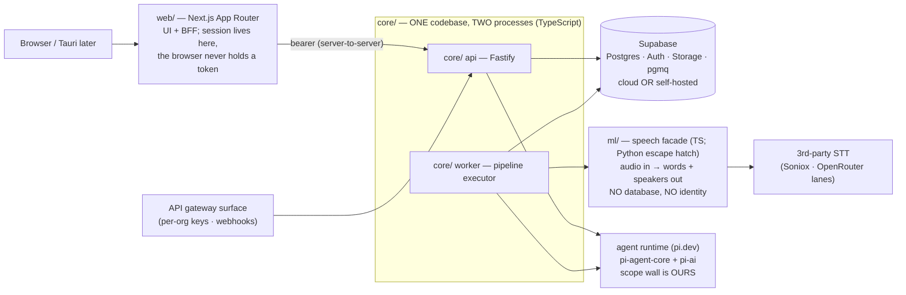

# Echo Platform — Architecture (v1.0 — LOCKED 2026-08-12)

> **Echo (اکو)** — the conversation-intelligence platform: calls and meetings
> become a searchable organizational memory with an agent that answers, built
> to be sold. Product behavior: [docs/SPEC.md](docs/SPEC.md). Decisions are
> numbered **M1…** and are **LOCKED (user, 2026-08-12)** — binding on every
> session; deviations go to the steward and are amended here BEFORE code. Repo:
> github.com/Dr-Bagheri/MVP (private). Brand family: the existing
> [Neurai Echo](https://github.com/Dr-Bagheri/Neurai-Echo) Android recorder
> shares the name; future path unifies it as Echo's mobile capture client.
> Predecessor lessons cited as (neurai-mvp: …) / (Echo app: …).

---

## M1 — The shape: four parts, three planes

- **web/** — Next.js App Router as UI + BFF: session server-side, browser
  never sees a token. Persian-first, bidirectional, fa + en interfaces.
- **core/** — identity, permissions, agent + tools, pipeline. One codebase,
  two processes (`api`, `worker`). Fastify. TypeScript, no exceptions.
- **ml/** — speech facade: audio in → words + speakers out. Stateless,
  productless, own upstream keys only. **[RULED by Phase-0 measurement]:
  TypeScript CONFIRMED** — sherpa-onnx-node installed prebuilt on Windows
  (no Python/node-gyp), OfflineSpeakerDiarization + Vad in one dep, clean
  clustering on synthetic ground truth (auto-cluster found 2/2 speakers,
  179/180 alternations on an 11-min file) and confirmed on real Persian
  audio (1-speaker clip → exactly 1 speaker found, no invented voices; the
  multi-speaker gate closes on the first real 2-voice recording).
  **RTF caveat (honest correction)**: the measured 0.41× was an idle-machine
  best case — under build-load contention the same file measured ~2× — so
  pipeline sizing happens on target hardware under representative
  concurrency, not from spike numbers. What survives: diarization is the
  heaviest CPU stage and gets its own worker concurrency budget.
  The Python hatch stays documented but UNUSED; if a measured gap appears on
  real Persian recordings, the fix is likely a different ONNX model, not a
  different language (same models either way). Confirmation gate: re-run the
  spike's diarize harness on the first real recording.
- **Supabase** — Postgres, Auth, Storage, pgmq. Cloud or self-hosted; same
  schema, same code, one env file of difference (M12).
- **Three planes, one rule**: control (identity/permissions/admin), work
  (pipeline transport), data (the record + rebuildable indexes). Anything
  with a fixed shape is plain code — no model in front of a known lookup.

## M2 — Tenancy: orgs first-class, individuals are orgs-of-one

Multi-tenant Postgres; every row carries `org_id`; RLS walls orgs from each
other and enforces the two call scopes (private / org). **Individuals and
organizations are both customers — an individual is an org-of-one in the
schema, no special case.** Target scale v1: multiple orgs × dozens of users.
Single-tenant per-customer deployment (their own Supabase) is the same schema
with one org — a deployment choice, not a fork.

## M3 — The permission stack (defense in depth)

| Layer | Catches |
|---|---|
| JWT signature check (Supabase Auth) | forged identity |
| one connection factory — the ONLY way to get a DB handle, identity required | queries with no user attached |
| the app's WHERE clauses | the normal, correct path |
| **RLS policy** | every bug in the layers above |
| **Postgres role grants** | writes/deletes no code path should ever perform |

- Identity can be built **from a row as well as a token** — pipeline jobs run
  as the call's owner, never as a service account.
- The agent's DB role has **no DELETE grant** anywhere; column-level grants
  narrow single-field tools (Echo app precedent: speaker-rename grant).

## M4 — The agent: Pi harness, our authority

- **pi.dev**: `@earendil-works/pi-agent-core` (loop, dispatch, state) +
  `@earendil-works/pi-ai` (unified providers, model discovery) — v0.84.x, MIT.
  **[Phase-0 verified live]**: embeds cleanly; ships no permission *system*
  but first-class mount points — `beforeToolCall`/`afterToolCall` in
  AgentLoopConfig where `{block:true, reason}` vetoes a call before execution
  — so the wall is our central policy at Pi's hook + our identity-carrying
  tool wrapper (belt and suspenders; measured: hostile prompt → 2/4 calls
  denied, identical denial shapes, foreign content never entered the
  transcript). Mid-session model swap works (`prepareNextTurn`). Build notes
  (Phase-0 friction, binding on core/): ESM-only; **LLM errors are IN-BAND**
  (`stopReason:"error"` on a normal-looking empty answer) — the runtime MUST
  surface message_end errors explicitly or failures look silent; reasoning-
  mandatory models (gemini-3.x) need `reasoning:"low"` passed — the catalogue
  carries a per-model flag; use `builtinModels()`, never hand-rolled
  createProvider.
- **One runtime for every agent** — user assistant and pipeline summarizer are
  the same code with different toolsets, run as a person (asker or call owner).
- All harness contact behind one interface file.
- **Agents are configuration**: prompt + model + tool list + optional
  per-skill tool-call ceiling (`max_tool_calls`, nullable → runtime default
  when unset) stored as data → skills editable without deploys (system <
  org < user; most specific wins). [Ceiling ruled 2026-08-12 — the field
  briefly outran the document; a heavy research skill and a two-call recap
  deserve different budgets, and the ceiling is part of what an admin
  configures.]
- One tool wrapper: scopes every call to the caller, records everything into
  `agent_runs` (replayable). Domain tools only — never shell/filesystem.
- **Assistant scope** [user ruling]: answers ANY question over ALL data the
  caller can reach — their calls, org-scoped calls, everything for admins —
  and never one row more. Same runtime, same wall.
- Prompt-injection posture: instructions never come from data; content enters
  prompts quoted; inferred writes are proposed first (approval card in the UI —
  Echo app's confirm pattern); tool scoping + role grants bound the blast
  radius.
- **Proposals live and die in their conversation** [ruled 2026-08-13]:
  there is deliberately NO pending-proposals inbox. A proposal read outside
  the conversation that produced it loses the sentence that made it
  approvable, and an inbox becomes a queue people feel obliged to clear —
  a consent property, not a UX preference. The confirm body is `{run_id}`
  only; the server re-reads the PROPOSAL from `agent_run.steps` (the
  agent's own record — a proposal cannot outlive its evidence), and the
  human's DECISION is recorded in **`echo.proposal_decision`** (db/0029,
  D20): approve or reject, one decision per proposal ever — the primary
  key IS the replay refusal — severable links so approvals outlive purged
  runs, and **no agent read grant: an agent reading the human's answer is
  how a decision becomes a prompt.** [Corrected again 2026-08-13: the
  "same transaction" form is NOT expressible — the decision inserts on
  echo_app, the product write runs on echo_agent, and different roles are
  different connections. Both constraints are right and jointly forbid
  atomicity, so **the ordering carries the guarantee: decision FIRST**
  (the primary key refuses a replay before anything can apply — the harm
  that reaches a person), then the write. The residual — a decision
  recorded for a write that then failed — is visible, duplicates nothing,
  and reconciles; the inverse residual (a doubled summary) reached the
  user. Schema-level tests may still assert the atomic form within one
  connection; the product path cannot have it. And the split is
  PROTECTIVE, not a limitation awaiting a fix (D20): applying the
  approved write as echo_app would restore atomicity — and would let an
  approved proposal touch columns the agent can never touch
  (confidence, provenance). **An approval widens who consented, never
  what may be written.** The tempting "tidy-up" — move the write onto
  the connection that already holds the decision — silently widens the
  blast radius of every approval and passes every test.] A confirmed write executes on the AGENT
  role — approval widens content, never the grant. [Corrected 2026-08-13:
  an earlier version of this entry recorded approvals inside
  agent_run.steps — revoked when it collided with 0011's closed-run
  invariant; the invariant won.]

**M4 amendment — persisted conversations [ruled 2026-08-13, from B1's
table-granularity instrument]:** `agent_session`/`agent_message` were
found as a designed-but-never-scheduled feature — real tables, real
policies (agent_session_own), a Q5 purge ruling (conversations survive
call purge, run link cut)… and zero rows, zero api surface, nothing
writing a thread. register_account at table scale, caught by the
instrument instead of a user. Ruling: **neither "missed" nor silently
deferred — designed schema whose build was never scheduled; now
scheduled.** It is load-bearing for the pivot: the hub IS the first
page, "proposals live and die in their conversation" requires a
conversation that exists to live in, and an assistant with amnesia
across reloads is not the product the user described. B1 builds the
api + agent-loop writer (sessions, thread append for both prompts and
replies, owner-scoped via the existing policies, Q5 semantics already
in the schema); B1 shapes the contract and steward ratifies — deciding
with reasons, not by steward over-specification. UI consumption
follows as a separate dispatch once the contract lands.
**BUILT + contract RATIFIED same day [B1, 540 tests, round-tripped
live]:** sessions open LAZILY (no "new chat" row before anything is
said; the assistant IS the page, so there is no creation moment to
hang a button on) — announced by a new additive SSE `session
{id, created}` event sent FIRST (lazy creation only works if
announced; unknown event types are ignorable so yesterday's client
keeps working). One agent_run per MESSAGE, never per session (a run
has status/tokens/replayability — none true of an afternoon;
agent_message.agent_run_id nullable is load-bearing: a human's turn
has no run). Titles derive from the first question, truncated on a
word boundary, NEVER rewritten (a title that follows the drift
renames the entry someone is scanning for while they scan). Resume
is a READ, never a replay from steps — the thread is the record.
tool_calls in the thread are codes only {id, name} (arguments quote
transcripts; the full trace lives on the narrower audit surface).
Ordering, both bug-shaped if reversed: the user's turn is written
BEFORE the stream opens (bad session_id = clean 404, not an error
event on a half-open SSE; a failed run leaves the question standing —
the honest record), the assistant's turn BEFORE `done` (a client
reloading on done must find the message, or messages vanish at
random); an assistant-persistence fault never breaks a stream being
read — swallowed at the stream, with the steward rider that swallowed
must still be LOUD in observability (dead-letter-sink family: the
run survives in agent_run, but a thread quietly missing a delivered
answer must be findable). Render rule [FE2, ratified]: a failed run
shows as an ANNOTATION on the user's message — no bubble, no role,
muted — because **the thread is the record, and our commentary on it
must never be able to join it** (a persisted "something went wrong"
bubble is, a week later, indistinguishable from something the
assistant said); a question counts as unanswered only when the run
is OVER (an error state shown on the normal path is how users learn
to ignore a warning).
**Truncation ruling [FE2 finding, ruled 2026-08-13]:** the persist
condition is emptiness, not failure — which yields TWO failed shapes.
Shape A (failed having said nothing): user message alone, unchanged —
persisting a turn that said nothing would be commentary wearing a
message's clothes. Shape B (failed AFTER emitting text): the partial
answer persists, and unmarked it **renders identically to a complete
answer the model chose to give** — in a product whose value is not
re-listening to the call, a truncated «سه موضوع مطرح شد: نخست» acted
on as whole is the worst available lie (fabricated completeness
arrived at by honest persistence — the history_since family, one
layer up). Ruled: **a marker on the EXISTING assistant row** when a
run fails after emitting text — annotating how a real turn ended,
never fabricating one; part of the messages() read; rendered as the
same annotation-not-bubble. Shape A's reasoning does not reach B.
Implementation ratified [B1, 576 tests]: `truncated` is **derived,
not stored** — LEFT JOIN to agent_run.status; the fact was already in
the database, so no migration and no second copy that can disagree.
`= true` deliberately, never `!== 'ok'`: an unreadable/missing run
yields null and the safe default is NOT claiming truncation — a false
"cut off" on a complete answer is its own lie. Purge edge — found independently by B1 and steward, RULED
**materialize-at-death**: Q5 cuts the run link on purge, so a purely
derived marker evaporates when its run dies — the truncated-reads-
as-complete lie returning one purge cycle later ("fails toward the
vaguer answer" is true of the system's claim and FALSE of the
reader's experience; **the record's honesty must not have an expiry
date**). Design: nullable marker column on agent_message stamped
ONLY at link-cut (trigger on agent_run delete or purge-job step —
B3's cut, record_status_change pattern: stamp the fact at the moment
it would otherwise be lost); read = COALESCE(stored, derived).
**At most one authoritative source at any moment** — column NULL
while the run lives, fills exactly at death — which dissolves the
two-spellings drift objection rather than overriding it. The `=
true` safe-null default remains correct for UNREADABLE runs
(transient); purge is gone-forever, a different nothing.
B3 narrowed the ask twice, both ratified: the stamp writes BOTH
outcomes (NULL-after-purge would make "fine" and "nothing wrote
here" identical — on a marker whose whole job is telling those
apart), and echo_app holds NO write on the column (never two
writable copies, applied to its own proposer).
RESOLVED [B3 0046+0047, 296 checks]: mechanism is **BEFORE DELETE
on agent_run** — the message-side trigger cannot work (ON DELETE SET
NULL fires after the run row is gone, the status already unreadable
in-transaction), and the purge-job step would put the rule in code
that must remember; **the database is where the fact stops being
readable, so it is where the fact gets written down**. 0047 fixed
the three-states bug the steward's "more endings" hint exposed: a
run still `running` at purge NEVER FINISHED — stamping it complete
is the precise lie the marker prevents; the stamp trusts only a
clean finish (anything not `ok` is not complete). Boolean kept, not
enum: failed-vs-never-finished belongs to the RUN (purged with the
call's content); the message needs one surviving fact — whether
what the reader sees is all of it. SEAM CLOSED [B3 0048–0050, 300 checks]: one predicate now serves
both halves — not-ok AND (terminal OR stalled past a window from
`started_at`). The four-migration churn is on the record by B3's own
insistence: 0049 removed the clock when append-after-resolve
ordering made it look redundant; 0050 restored it for the reason
neither session had said — **the start time frees the read from
depending on that ordering AT ALL** ("I had removed the structure
and kept the dependency" — depending on another package's discipline
where structure can carry the answer is the wrong direction). All
four steps reasoned in 0050's header so it cannot oscillate a fifth
time. **NO SWEEPER — ruled by B3, steward's suggestion declined
with better reasoning, ratified**: stale `running` rows are hygiene,
not correctness, now that the predicate handles them — bounded and
query-discoverable. The sweeper earns its place only when "runs in
progress" becomes a number a person acts on — and then as a named
operation with an explicit actor, never a silent background writer
on agent_run.

## M5 — Models: all cloud, user-chosen, admin-curated, no Claude

- **No local LLMs, no Ollama, no air-gapped profile** (user decision —
  deliberate reversal of neurai-mvp D14/D15).
- **No default model.** Each user picks from the catalogue (tool-capable
  only). The UI's pre-selected *suggestion* is the strongest model for our
  domain + Persian — a ranking the steward maintains by eval (currently the
  Gemini Pro line per published Persian benchmarks).
- **Claude is excluded from the catalogue** (user directive).
- **Admins curate**: per-org allow-list controls which models members see
  (also the cost lever, since usage has no product UI — M15).
- Providers via `pi-ai` with **OpenRouter** for breadth; **the catalogue
  source is `pi-ai`'s `builtinModels()`** (Phase-0: 39 providers / 335
  OpenRouter models generated) — we FILTER (tool-capable, no Claude, per-org
  admin allow-list, reasoning-mandatory flag) rather than build.
- **[AMENDED 2026-08-12, steward] Unattended runs resolve a model by
  ladder** — "no default model" is a rule about a person choosing, and the
  pipeline summarizer runs for an owner who may never have opened settings:
  owner's preferred model → org summarizer default (v1 stand-in: first
  entry of the admin allow-list, documented as deliberate) → operator env
  fallback → and when nothing resolves, the summary is **skipped with a
  visible, retryable flag**. A missing model may cost a summary, never a
  call — the transcript is the record (invariant 1), and the summarize step
  re-queues once a model exists.

## M6 — Speech: API-first behind ml/, diarization local, Persian-focused

- Transcription: **Soniox PRIMARY — ratified by measurement on the user's
  real clip (2026-08-12)**: 0.12× realtime, every token timestamped and
  monotonic, correct ZWNJ and colloquial register, natural fa/en
  code-switching; proper nouns are the known weak spot. **Persian WER:
  2.1%** [measured 2026-08-13 against the user's human-corrected
  reference, post-normalization so orthography doesn't count as error]:
  2 substitutions (both loanword/filler spelling variants), 1 insertion,
  **0 deletions** — nothing dropped, which is the number that matters;
  spelling wobble is survivable, missing words are not. (n=1 clip;
  more references extend it.) **Integration
  requirement**: Soniox returns SUB-WORD tokens — ml/'s adapter MUST assemble
  words via the leading-space convention (new word per space-prefixed token,
  start from first token, end from last, speaker survives assembly) or the UI
  receives unclickable fragments. OpenRouter ASR lane: fallback only —
  measured on the same clip: near-identical text quality but **zero
  timestamps and zero speakers** (structurally, via chat completions), and
  ~10× the token cost.
- **Word-level timestamps required** (click-a-word seeks; words align to
  speakers). (Echo Mobile: proportional estimates were a visible quality gap.)
- **[Steward ruling, refined by head-to-head measurement]** The fallback
  lane produces NO timings at all. Policy when the primary is down:
  **degrade-and-flag, never lose the call** — the result carries
  `timestamps: "none"` provenance end-to-end; the UI shows the transcript
  with seek DISABLED and the degraded flag visible; the call queues for
  automatic re-transcription when the primary recovers. Silent degradation
  and total failure both forbidden.
- **Soniox diarizes natively** (async, per-token speakers, up to 15) — local
  diarization (sherpa-onnx or the Python hatch) is the fallback for lanes
  without it, plus the independence hedge, behind ml/'s Diarizer interface.
- **Languages**: Persian primary; incidental English inside Persian calls
  handled by the STT. UI in fa + en; **summaries always Persian** [user ruling].
- Diarization local in ml/ (ONNX on CPU; whole-file clustering, tunable
  threshold). Two-channel audio → speakers from channels, no diarization.
- VAD (Silero, ONNX): trims silence before paid STT; utterance boundaries.
- ffmpeg transcodes **any audio format** [user ruling] to pipeline format.
- **[AMENDED 2026-08-13, from the user's real 2-voice clip]** The
  channels-are-speakers rule fires ONLY when the channels actually differ
  (`channelsAreDistinct()`: L−R energy vs single-channel, 20 dB margin).
  **Dual-mono — one microphone duplicated into two channels — is what phone
  memos, screen recorders and most re-encodes produce**, and the unguarded
  rule transcribed every word twice, invented two speakers who were one
  person alternating with themselves, and doubled the STT charge on every
  such file, silently, with all-but-one checks green. The rule was written
  for telephony (each party its own leg) and was never true of consumer
  audio. Dual-mono downmixes and diarizes, loudly. Second finding, **[CORRECTED
  2026-08-13 — the over-split caveat was WRONG, and the correction is a
  casebook rule]**: the clip is a FOUR-person conversation — Soniox and
  the local diarizer independently agree on 4 (median turn gap 0.18s, a
  backchannel-only voice, a participant addressed by name); "the number
  2 came from what someone typed in the filename." The sweep was scoring
  a correct-ish clusterer against a fabricated target. Real defect
  underneath: a mis-set default — threshold 0.5→**1.0** (yields 4 on the
  4-person clip; the single-speaker CONTROL is flat at 1 across the
  whole range, which is what makes the change safe). Deliberately NOT
  1.05-which-fits-exactly (fitting a constant to n=2 recordings), and
  1.0 errs toward over-split, the fixable direction: a human can merge
  at speaker-linking; a merge reads as fact. minDurationOn/Off rejected
  as the knob — it barely moves clusters while DELETING 17% of speech
  (M21: the knob that most reduces splitting is the one that deletes
  the user's words). Conditions attached: two recordings, Persian,
  counts 1 and 4, threshold specific to this embedding model.
  **Crosstalk bound [measured 2026-08-13, synthetic-with-method
  overlay of two real passages]**: under full overlap, **30% of words
  vanish while every indicator reads clean** — both voices detected,
  transcript coherent, confidence drop (4pts) inside normal
  between-clip spread; "it reads as an ordinary conversation that is
  simply missing a third of itself." No cheap signal exists — a real
  overlap detector is a model (pyannote) and a package of its own
  [BACKLOG, named]; until then this is a recorded forfeit the pipeline
  cannot see or declare (the M21 clause with nothing behind it —
  written here so it is a known bound, not a discovered one). Third: M21
  enforcement — `max_speakers` is a hint that is REPORTED ON when exceeded,
  never a knife; the fallback normalizer briefly deleted speech to satisfy
  a config number (the forfeit hierarchy inverted), fixed with regression.

## M7 — Recording model & pipeline (DAG on pgmq)

- **No live transcription in v1** [user ruling].
- **30-minute parts** [user ruling]: a session longer than 30 min auto-splits;
  each ≤30-min part is its own audio file, all parts belong to ONE call with
  ONE title and a continuous timeline. Schema: `calls → parts → transcript
  rows`. Browser capture writes parts crash-safe as it goes; upload of part N
  starts while N+1 records.
- DAG per part: `upload → transcode → vad → transcribe → diarize` ; per call:
  `→ link-speakers → summarize → ready` (summary spans all parts).
- Status column IS the position; every step idempotent (checks its artifact,
  not a done flag); retries with backoff → dead-letter; a failed call is
  visibly failed and resumable. (Echo app lessons: race-safe claiming, orphan
  requeue on worker start, missing-part skip-with-gap rather than whole-call
  failure.)
- **[AMENDED 2026-08-12, steward + Backend 2]** Queue transport ≠ status
  ladder: ml/'s `/process` performs transcode/vad/transcribe/diarize in ONE
  approved call, so the per-part rungs ride ONE queue message
  (`process_part`) that walks the status ladder — the per-part statuses stay
  as the progress positions, but "one step per queue message" holds only for
  the per-call steps (`link_speakers`, `summarize`). Retry re-pays STT only
  in the narrow crash window between a successful ml/ response and the DB
  write — judged acceptable against splitting ml/'s facade into four
  stateful endpoints (invariant 6). The three unused per-part queues from
  db/0017 are dropped in db/0019 rather than left as a pipeline-shaped lie
  (0021 retires the last; the suite asserts the exact inventory AND that no
  retired name returns).
- **Enqueue contract (security-relevant, promoted from db/0021's record):**
  every job payload carries `{callId, ownerId, partId}` where **`ownerId`
  must be written by the enqueuer while a genuine caller is present** — it
  is how M3's "pipeline jobs run as the call's owner, never as a service
  account" survives contact with a queue. The worker resolves identity FROM
  the payload, re-reads the call as that owner, and fails closed if it isn't
  visible; there is no privileged lookup for a job to fall back on. This
  contract lives in JSON, not in the schema — which is exactly why it is
  recorded here.
- The DAG invokes the agent as an ordinary function call, as the call's owner.

## M8 — Data & retrieval

- **Schema in hand-written SQL** (numbered migrations); queries via
  **postgres.js** (`postgres` ^3.4.5 in core/; db/'s runner uses pg)
  [CORRECTED 2026-08-13 — was "Drizzle for queries only". Drizzle was
  never installed: the blueprint session verified no workspace
  dependency anywhere, while core/ was built, reviewed, and 576-tested
  on postgres.js tagged-template SQL. The deviation was never flagged
  by any session — discovered by documentation, which is itself a
  finding (a per-dependency claim forced the check, the
  built-vs-designed table's lesson again). Ratified retroactively
  because the decision's REASON is served better, not worse: hand-
  written SQL owns structure AND queries; no query-builder layer to
  drift from the RLS/grants wall]. Generators can't emit
  RLS/roles/grants and would silently drop the security layer —
  unchanged.
- **Transcripts: one segment per row** (search, windows, surgical corrections).
- **Search**: Postgres FTS (`tsvector`) over transcripts + summaries; RLS
  filters by construction. Persian normalization (TS port of `fa_normalize`)
  at ingest AND query. Search returns **offsets, not content**; the agent
  expands the windows it wants — context is the budget.
- **pgvector reserved** for the Projects/wiki layer — don't embed what you can
  look up exactly.
- `jsonb` for tool payloads (`agent_runs`), skill definitions, version metadata.
- Versioned summaries (pointer moves, versions survive); corrected lines keep
  identity + edited mark; roster edits are change-lists.

## M9 — Language & stack

| Concern | Choice |
|---|---|
| Language | **TypeScript-first**; Python only inside ml/ if measurement demands (M1) |
| web/ | Next.js App Router · next-intl (fa default + en) · RTL-first · Vazirmatn · ui-ux-pro-max-driven design system |
| core/ | Fastify · pnpm workspaces · zod at every boundary · pino (no content in logs) · SSE streaming |
| ORM | none — postgres.js tagged-template SQL (queries); SQL owns structure [CORRECTED 2026-08-13, see M8] |
| Queue | pgmq |
| Tests | Vitest · **SQL test suite for RLS/grants** (the wall gets its own tests) · Playwright E2E |
| Desktop | Tauri wrapper, phase 1.5 (same Next.js app; native capture stays out per spec) |

## M10 — Security completeness (the sellable bar)

Signed URLs for all audio; private buckets; TLS (nginx); CSP + security
headers; zod everywhere; secrets in env/secret stores only (publisher-enforced,
as in all our repos); audit = `agent_runs` + admin action log; structured
no-content logs; OpenTelemetry/error-tracking seams; scheduled `pg_dump` +
storage sync with a rehearsed restore drill. Spec-excluded items (SSO,
compliance suite, rate limiting, device revocation) stay excluded **with
designed seams** (M14).

**Storage access model [promoted from the ops checklist, 2026-08-12]:**
`storage.objects` carries RLS enabled with **zero policies — deliberately,
permanently**. With no policy, nothing reaches an object except the service
key, which is the whole model: core/ mints short-lived signed URLs
server-side and no client ever talks to storage under its own authority. A
policy added here to "make uploads work" would silently swap signed-URL
access for client-side access — a different security model wearing the same
clothes. If an upload seems to need a policy, the missing piece is a signer,
not a policy.

## M11 — Access, deletion, retention [user rulings]

- Members see and manage **their own** calls (+ org-scoped ones read-only per
  spec's scope rules). Admins **read everything** in their org.
- **Admins may delete ANY recording — including members' private ones.**
  Members delete only their own. Human, plain-code paths, always logged.
  **[AMENDED 2026-08-13 — "always logged" named honestly]**: admin
  deletions write admin_action (live); a MEMBER's own deletion is
  today recorded only as the `deleted_by` stamp on the row itself —
  which the purge job eventually deletes, so after the 30-day window
  no trace remains that a deletion happened. RULED, direction now /
  build deferred: **member deletion events get their own
  metadata-only record surface** (actor, call id, timestamp — codes
  never content; severable link, survives purge exactly as
  proposal_decision outlives purged runs — the precedent that kept
  admin_action's name honest). "Purge removes the content" and "the
  trail is append-only" were never about the same thing: the row's
  content purges; the fact of a deletion is not content. Until the
  build slot, this sentence is the record of the gap (found by 0055
  making a narrowed policy visible — the drizzle lesson pre-empted:
  the doc must not promise what does not exist).
- The **agent deletes nothing, ever** (role grant — M3).
- **[Ratified round 3]** Deletion = soft-delete with a **30-day purge
  window** (visible to admins), then hard purge of audio, transcript, and
  derived data together.
- **Speaker directory privacy [user ruling]**: voices from private calls do
  NOT enter the org's shared speaker directory automatically — they join only
  when the **owner links** the voice (or records/uploads with linking). The
  directory is built from deliberate acts, never from passive capture.

## M12 — Deployment profiles

1. **Local dev**: everything on the user's machine — local
  processes + a dev Supabase project — until publish time [user ruling:
  host + domain chosen later].
2. **Cloud (launch)**: managed Supabase + core//ml/ containers + web/ on
  Vercel or same host.
3. **On-prem (per customer)**: self-hosted Supabase + same containers via one
  Docker Compose; models stay cloud (LLMs are online by decision — what moves
  on-prem is data at rest + the pipeline).

**[AMENDED 2026-08-15 — profile 2 is CURRENT, user-directed]**: the host +
domain are chosen: **neurai.pt** (registered at one.com, DNS on Cloudflare
free tier; the one.com mailboxes ride on copied MX records). Backend =
**Hetzner CX22** (Falkenstein, Ubuntu, `neurai-core-1`, 178.105.251.216):
api/worker/ml as systemd services under a non-root `neurai` user, deployed
from `git archive HEAD` + the gitignored ml/models, secrets in root-only
`/etc/neurai/` env files **split per Invariant 6** (ml's env carries only
its upstream keys + ML_* — never a product credential). Public entry =
**Cloudflare Tunnel** `api.neurai.pt` → localhost:8080 (outbound-only; the
box accepts SSH and nothing else inbound). web/ stays on Vercel with
`CORE_API_URL=https://api.neurai.pt`. The PC's start-platform scripts
remain the LOCAL-DEV path only; the PC is out of the serving path.
Secrets provisioning = `scripts/deploy-secrets-to-server.ps1` (names in
the script, values DPAPI-store → server over SSH; run by the user).
Not yet hardened: the BFF↔core pre-shared edge header (JWT walls every
route meanwhile) — tracked, ships with the CORE_API_URL flip.

## M13 — Clients roadmap

v1 web/ (responsive) → v1.5 Tauri desktop → future: unify the Neurai Echo
Android app as Echo's mobile capture client (M18 brand family).

## M14 — Designed seams (excluded from v1, additive later)

Projects + per-project wiki (pgvector activates) · named connectors (catalogue
previews in v1; **the gateway ships in v1** — M17) · SSO · compliance suite ·
rate limiting · device revocation · agent long-term memory · billing wiring
(M15 leaves the states, not the payments).

## M15 — Monetization & access [user rulings, revised round 3]

One subscription = the whole package; no feature gating inside a paid plan.
**No trial of any kind.** Access model: a person can **register themselves**
— username + password, or **one-click Google (Gmail) sign-up** (OAuth) — but
the account sits in a **pending state until an admin accepts it**. Nothing is
visible or usable before acceptance. Schema: `user.status`
(pending/active/disabled) + `org.status` (active/suspended); payment
processing is a later seam. **No usage view in the product** — internal
metering only, for our own cost visibility.
**[RE-AFFIRMED 2026-08-13, user-delegated steward ruling]**: v1 ships no
usage surface, even with gateway keys + assistant spend live. The worst
leak vector is bounded (allow_assistant per-key, default off), and every
agent run already records tokens_in/tokens_out — so a usage view remains
derivable at any time without new instrumentation. It joins the M14 seam
list; building it is a decision for when a customer's bill question
actually arrives.
**[Amendment, schema round]**: acceptance is two-tier — members joining an
EXISTING org are accepted by that org's admin; a self-registered NEW org
(including org-of-one individuals) is accepted by **the vendor** — acceptance
is the commercial gate. v1 ships a minimal vendor acceptance procedure (not a
console). Ratified with it: the current-summary pointer moves only via a
SECURITY DEFINER trigger (the agent holds zero grants on echo.call), and
**assistant conversations are private even from admins** — the admin audit
surface is agent_run (what the agent did), never colleagues' conversation text.
**[AMENDED by the user, 2026-08-15 — round 4 #1, approved]**: registration
is **fully self-serve: email confirmation IS the acceptance.** Sign-up →
confirm email → the account is ACTIVE (owner of the org chosen at the
org-choice screen). No vendor acceptance, no pending state on the happy
path. This supersedes the round-3 approvals-console directive; the
vendor-identity proposal stops being registration-critical (it may return
for other vendor operations). The pending status stays in schema (invited/
edge states; suspended flow unchanged); nothing routes there by default.
Prerequisites for the email leg, both dashboard-side: custom SMTP (the
built-in sender rate-limits at ~2–4/hr) and Site URL + redirect list
pointing at the deployed web origin. D25 (invited → active) already agrees
with this shape.

## M16 — (folded into M7: the 30-minute part model)

## M17 — Connectors & the API gateway [user ruling]

v1 ships a **public API gateway**: per-org API keys + webhooks so ANY
platform — including ones we haven't met — can push audio in and pull
transcripts/summaries/answers out ("a code or a link" integration). Gateway
requests carry the org identity and hit the same RLS wall as every other
path. The connectors catalogue (chat/CRM/documents/calendar/storage) ships as
preview; named connectors are later built ON the gateway. MCP is the likely
transport for agent-side connectors when they arrive.

**[AMENDED 2026-08-12, steward]** Two rulings from the build:

- **Assistant access is per-key opt-in.** A key reaching
  `POST /v1/assistant/ask` spends model tokens without bound, and v1 ships
  no rate limiter (M10/M14 seam — a real limiter is a design decision, not
  a patch). So `api_key.allow_assistant` (default **false**, db/0022): a
  leaked or runaway key can pull transcripts, not drain a model budget,
  unless an admin deliberately granted it answers. Fits M5's
  admin-as-cost-lever; the enthusiastic-but-authorized integration stays
  the admin's accepted risk until the M14 limiter exists. **A key's
  capabilities are immutable once issued** (ratified from the build):
  granted at mint, no PATCH — changing capability means revoke + reissue,
  so the audit reads "one credential ended, a different one began" rather
  than a key whose meaning depends on when you looked.
- **Webhook bodies carry identifiers and status ONLY** — `{event, call_id,
  org_id, occurred_at, status}`; never a title, never text, never a speaker
  name. The consumer comes back through the gateway to read content, under
  the wall and in the audit trail. This is an **invariant** (the outbound
  twin of "content never in logs"), not a convention — a "just include the
  title, it's convenient" change is a security regression, not polish.
- **A webhook acts as its creator** [ruled 2026-08-13] — deliveries run
  under the authority of the admin who created the webhook (payload carries
  the identity from enqueue time; `identityForJob`'s fail-closed re-read
  applies unchanged). Consequence, stated rather than discovered: **demote
  or disable that person and their org's deliveries stop** — fail-closed,
  and deliberately the same posture as D6's keys ("disabling an employee
  stops their integrations immediately"). The admin UI eventually shows
  "runs as X" so the dependency is visible. The rejected alternative, for
  the record: relaxing delivery RLS and enforcing admin-only viewing in
  route code — declined because it moves an authorization rule out of RLS,
  against M3's premise.

## M18 — Name: Echo (اکو) [user decision]

One brand family with the Android recorder — which is referred to as **Echo Mobile** everywhere (docs, conversation, UI copy) so that plain **Echo** always means this platform. Steward flag on record: global
trademark adjacency (Amazon Echo) — irrelevant to the current market, revisit
only if Western registration ever matters.

## M19 — Database decisions ratified [steward, 2026-08-12, post-lock amendment]

`db/` shipped with its own numbered decisions (db/DECISIONS.md D1–D13); after
line-review of the SQL and a green 135-check suite against the dev project,
the steward **ratifies all thirteen** as the binding refinement of M2/M3/M8/
M11/M15/M17. The ones that constrain other packages, by name:

- **db/D2** — identity arrives as `SET LOCAL echo.actor_id` set by core/'s
  connection factory; setting that GUC IS authenticating.
- **db/D3** — `echo_app`/`echo_agent` hold no DELETE anywhere; `echo_purge` is
  the only deleting role and only past the 30-day window; `summary` and
  `admin_action` carry **no UPDATE grant for any role**.
- **db/D8** — SECURITY DEFINER doors reachable from core/ are ENUMERATED,
  each with its reason [AMENDED 2026-08-13, was "exactly two"]: the two
  pre-identity doors (`register_account`, `resolve_api_key`) + the two
  named deletion operations (`soft_delete_call`, `restore_call`, db/0032)
  — added because M11's owner soft-delete was structurally impossible as
  a plain UPDATE (the post-image is invisible to its own actor under Q2's
  read policy), and a named definer operation preserves Q2 exactly where
  any policy widening would have overturned it. Direct `deleted_at`
  writes are refused for ALL application roles including admins — "a
  path that succeeds for the privileged caller and fails for the
  ordinary one is exactly how this survived" unfound. The
  vendor-acceptance pair stays operator-only (`echo_vendor`, db/D13).
- **db/D9** — composite FKs make cross-org references structurally
  impossible. [Extended 2026-08-13, from the enqueue-policy near-miss:
  D9 is also the ESCAPE from RLS policy composition — an EXISTS guard in a
  policy runs as the caller and silently intersects with the other table's
  policies; the composite FK needs no policy at all. When a policy wants a
  fact about another protected table, that is the signal to reach for a
  constraint, not a subquery.]
- **db/D11** — assistant sessions are private to their owner, admins included;
  the admin audit surface is `agent_run`, never conversation text.
- **db/D12** — pgmq queues created where pgmq exists; only `echo_app` may
  drive them. [AMENDED with M7 2026-08-12: one queue per part
  (`echo_process_part`) + one per per-call step; db/0019 drops the three
  per-part step queues 0017 created.]

Open questions ruled (steward): **Q2** as built — only an admin restores a
soft-deleted call; deletion feels like deletion to its owner. **Q3** as built —
any active member may rename directory entries; linking stays owner-only
(that is the privacy-bearing act, M11). **Q4** ratified — the "reads
everything, rewrites nothing" rule applies to human admins exactly as to the
agent. All three are cheap one-policy reversals if product experience argues
otherwise; user may override.

Post-review additions, same authority (0018): **db/D14** — a skill is
archived, never deleted (`archived_at`; live slugs unique via partial index
so a retired slug can be re-created; no role holds DELETE on `echo.skill`
because `agent_run` provenance must stay replayable). **Q5 ruled (v1)** — an
assistant conversation is the asker's own record: it survives the purge of a
call it discussed, with the run link cut (`on delete set null`). The
compliance-grade alternative (purging messages whose run pointed at the
purged call, in-transaction before the FK nulls) is expressible in the schema
and deferred with the rest of the compliance suite (SPEC: not v1). User may
override. Ratified with 0018: the D13 `current_user` seam now also governs
`tg_call_guard`'s ownership rules — a definer-path pointer move (no product
identity) is the operator seam, not a rewrite.

Model-integration testing rule (from ml/'s Silero finding, binding on every
package that wires a model): **a model wired up wrong usually fails silently
and passes negative tests** — every model integration must include at least
one assertion that something is positively detected on real data, and a
warning path when a component silently finds nothing. Second finding, same
family (sherpa-onnx CJS-under-ESM: a broken diarizer reported healthy):
**a health check must resolve the specific callable it guards** — probing a
module's presence is not a health check. Third, the fixture-independence
rule (CLAUDE.md rule 9): a test cannot fail when its fixture is derived from
the same belief as the implementation — at least one fixture per feature
must come from reality. Fourth, the altitude-of-fakes rule (CLAUDE.md rule
11, from the M15 401-bounce): when faking a COMPOSITION of access rules,
fake the rules, never the composition's output — the identity path is
tested against real RLS across {active, pending, suspended-org, unknown}. Running tally of structural choices that caught bugs
no test was looking for: composite FKs (db/D9); `UNIQUE (call_id, seq)` —
which surfaced the cross-part numbering collision on every >30-min call; and
`transcript_segment_words_is_array` — which turned double-JSON-encoding from
a silent corruption (every queue payload stored as a quoted string) into a
one-line diagnosis. Constraints are the tests you didn't know to write.
Milestone-3 postscript (Backend 1's closing observation, kept because it
names the split): every defect that milestone produced — zero tools
offered, silent 500s, an unread preference, an invented column, an omitted
NOT NULL, a one-sided contract — was a **configuration or contract fault,
not a logic fault**; a 411-test suite caught none of them, and a one-file
harness caught six. The suite answers "is the logic right"; the harness
answers "is the system actually assembled" — different questions, and a
product's last-mile defects are nearly all the second kind. And a third
question neither answers (the no-Claude finding: 28 barred models served
live through a full verified end-to-end run): **"does it obey the rules we
already have" — running something proves it behaves, not that it should
behave that way.** Compliance is checked only by reading the rules against
the output; its mechanized form is the negative-space test, and its
precondition is the rule living where a session will actually meet it.

Runtime-boot corollary (worker E2E finding, strengthened by the api boot
smoke): core/ runs on `node --experimental-strip-types`, which strips
annotations but performs NO transforms — vitest transpiles fully, so **a
passing vitest suite is not evidence the process starts** (TS parameter
properties loaded 39-tests-green and refused to boot; api/main.ts did not
EXIST under 219 green tests, then silently exited 0 via a Windows-false
entrypoint guard — compare entrypoints with `pathToFileURL`, never string
equality). The milestone bar is therefore **starts under the production
runtime AND answers one request**, not "it loads". Diagnostics convention,
same finding: log Postgres's STRUCTURED error fields
(code/constraint/table/column), never message OR detail — both quote row
values, which can be transcript content (invariant 7); redact `detail` at
the logger level too, so it cannot arrive by another route.

## M20 — The timing ladder: word → line → part, never nothing [steward ruling, 2026-08-12]

Refines M6/M7; settles the frontend's degradation flag and the seek-to-zero
concern in one rule. Part-level timing always exists **structurally**
(`call_part.offset_ms` and `transcript_segment.start_ms/end_ms` are NOT NULL —
the schema cannot represent an untimed segment), so the degradation ladder is:

1. word timestamps (Soniox lane) → click a word;
2. segment timing only → click a line;
3. prose-only fallback (`provenance.stt.timestamps: "none"`) → ONE segment
   anchored to the **speech span** it came from (first speech → last speech
   within the part, which VAD knows even when the STT lane carries no
   timing); a click seeks to where the speech begins. Usually tighter than
   the part itself — a boundary-aligned stamp is the unusual case, not the
   rule. [WORDING CORRECTED 2026-08-12 to match the implemented contract;
   flagged by the frontend, verified against core/'s mapping code.]

Nothing is ever unclickable-because-untimed, and nothing silently seeks to 0.
Division of labour, deliberately: **ml/ stays productless** (invariant 6) —
its timings are 0-based within the audio it was handed; **core/'s worker**
anchors them (adds `part.offset_ms`) and synthesizes the anchored-span
segment on a timing-less result. core/ refuses to store a segment with
`end_ms <= start_ms` for a non-empty part — the "timing quietly became zero"
class dies at the boundary, not in the UI. A 200 from ml/ is not
automatically full fidelity: `degraded` + `timestamps:"none"` ride provenance
into storage; the UI's per-row `end_ms > start_ms` gate implements the ladder
unchanged, and the call-level «رونوشت با دقت کاهش‌یافته» chip stays a quality
signal, separate from seek mechanics.

**Segmentation rule [ruled 2026-08-13, from the single-speaker finding]:**
a transcript segment breaks on **speaker change OR a VAD speech-boundary**
(`speech.segments` — silence measured from the audio itself, already
delivered by ml/ and previously discarded), with a word-count backstop for
a lane that provides neither. Speaker-change-only was a defect, not a
preference: an 86-second monologue landed as ONE segment (a 30-minute
dictation would too), which (1) erases M20's middle rung — no lines exist
to degrade to; (2) makes the search snippet's unit the entire call; and
(3) breaks ml/'s contract split — "ml/ returns words, not lines; lines are
the product's to build" — with the product not building them. The VAD
boundary is a fixture from reality, not an invented threshold (rule 9).

Call-level summary field (contract, 2026-08-12): `transcript_timing:
"full" | "mixed" | "none" | null` — snake_case like every Call field;
**null when no transcript exists at all** (failed, deleted) because
`"none"` claims a prose-only transcript that is real — absent ≠ "none".
Always derived (per-part flags are the stored truth), and structurally
unusable as a gate: the per-row words are the only seek authority.

## M21 — The forfeit hierarchy: what the system may lose [steward, 2026-08-12]

Two packages arrived at the same sentence from opposite ends — "a missing
model may cost a summary, never a call" (M5) and "a moved contract may cost
fidelity, never a recording" (ml/ vocabulary drift) — which is what earns a
principle a number:

- **The system decides what it may lose, and the answer is never the user's
  data.** A missing model costs a summary; a moved contract costs fidelity;
  an unrecognised error costs a retry; a failed part costs a gap. In every
  case the derived artifact is forfeit and the record survives — the
  transcript is the record (invariant 1) and everything else is rebuildable.
- **Whatever is forfeited is said out loud** (rule 7): degrade-and-flag,
  `vad_found_no_speech`, `summary_skipped_reason`, `DEAD LETTER UNRECORDED`
  — one shape everywhere. Silent degradation is the failure; visible
  degradation is the design.
- **The boundary of the rule: degrade what the system INFERRED; fail on
  what the system was TOLD.** A model choice, a timing lane, a vocabulary
  version are inferences — losing one costs fidelity. A shipped system
  skill is a declaration: its absence can only mean broken configuration,
  and proceeding would launder a defect into a plausible artifact — a
  summary generated on the wrong prompt is worse than none *because it
  looks correct*. This is the asymmetry behind the loud-floor corollary,
  stated so the next person doesn't "fix" the inconsistency in either
  direction.
- Underneath all of it: **the user's recording is never what gets spent.**

## M22 — The NeurAI platform [user directive + design verdict, 2026-08-13]

**M18 is REVISED: NeurAI is the platform; Echo (اکو) is an app inside it.**
Echo Mobile naming unaffected. Full directive record: docs/PLATFORM-BRIEF.md;
design authority: design-system/neurai-platform/ (PROPOSAL-01/-02 +
hub-mock, all user-approved).

- **First page = the AI-assistant hub**: icon rail (inline-START), centered
  N-mark (no orb — the mark, with an idle glow doing the orb's job) over
  the greeting; the caption IS the scope promise («هرچه بپرسید در محدودهٔ
  دسترسی خودتان می‌ماند»); prompt box; app cards — Echo only, NO invented
  tiles. Top bar: en/fa switcher · global search · avatar. Menu bottom:
  Settings · Help · GitHub link. On the hub the assistant IS the page;
  selecting Echo docks the assistant (bottom sheet under md, never open on
  load) and opens Echo's surface: **Record on top, Calls below, one
  screen**. Mobile shell: bottom bar of four (Hub · Echo · Management ·
  More); the law: **the app must be reachable on load, at every width,
  without dismissing anything.**
- **Design system**: computed violet family from the measured brand
  (#A274FF on #130036), verify-pairs.mjs as the running gate, dark-first
  with light DERIVED; ONE accent family — Echo identified by its soft-red
  mark (#FF6F59, measured away from --danger), never a second palette.
  The N-mark always sits on its indigo (tile on light surfaces; the hub's
  canvas IS the tile color). --on-accent is dark; --border splits from
  --border-strong. **DEFAULT_THEME = dark, one constant, one answer per
  document [ratified 2026-08-13]**: the two-theme-stores defect (the
  anti-flash script read one key defaulting light while the toggle
  wrote another defaulting dark — the script caused the flash it
  existed to prevent, and a chosen theme was lost on every first
  paint) is fixed structurally: `lib/theme.ts` owns the key and
  default and GENERATES the inline script, so drift is
  unrepresentable; Echo's screens follow the platform's dark-first.
  Group labels: `--fg-subtle` recedes from `--fg-muted`, and
  verify-pairs asserts the RELATIONSHIP (subtle < muted), not just
  legibility — a future "improve the label contrast" would silently
  restore the flat menu while every absolute check passed.
- **Breadcrumb trail [user directive, built 2026-08-13; supersedes the
  per-page back affordance]**: top-bar trail, ancestors clickable =
  the back navigation, deepest crumb = non-clickable page title
  (aria-current), locale-aware by construction; hub renders NO trail
  (a one-crumb trail is a label that navigates nowhere, on the one
  screen whose anatomy the user signed off); at 375 the trail
  re-renders as chevron+parent — the same trail in its most compact
  honest form, never a second thing to sync. **The trail is a
  DECLARED TABLE (trail.ts: parent+label per route), never a pathname
  split [ratified]**: /calls sits under Echo in the product's IA and
  the URL does not say so — a path-derived trail quietly teaches an
  IA that the rail, the hub cards and the pivot all contradict.
  Coverage instrument: every servable route has a trail entry or an
  explicit reason (derived from the route tree — a hand-written route
  list is a second thing to remember); crumb labels must match the
  page's own h1 in BOTH locales (a crumb naming a page differently
  from its own heading is the same drift one layer out); no dynamic
  pattern may be anyone's parent. Title hook distinguishes
  null (genuinely untitled) from undefined (not loaded) — kinds of
  nothing, again.
- **Management adopts the Settings layout [user directive, built
  2026-08-13]**: ONE extracted `TwoPane` component renders BOTH
  admin surfaces (copying it would mean every grouped-header fix
  made twice, "and the second one is the one nobody makes"); nav
  model declared in one place. Groups answer different questions:
  افراد / دستیار / سرویس. Ratified decisions: **/management keeps a
  landing, never redirects into a section** (Users is admin-gated —
  a redirect would make a refusal card the first thing Management
  ever shows a member; the cards say what a section is FOR, the menu
  says its name — not the menu repeated); **a role refusal keeps the
  pane** (stripping the shell strands the user beside siblings they
  may open); **no back affordance inside a pane** (with the menu
  permanently beside, a section isn't descended into — the
  breadcrumb carries the way out of the surface). /management/models
  now in menu AND cards, carrying honest `notWired`, named by its
  own h1.
- **Conversation is a STATE of the hub, not a redesign of it [ruled
  2026-08-13, FE2 proposal; reversible by user preference]**: IDLE =
  exactly the approved anatomy, unchanged — what a user meets on
  arrival and returns to; ACTIVE = the thread replaces the
  centrepiece, the prompt box moves to the foot and stays the thing
  you type into (mark/greeting/cards step aside, never pushed down a
  scrolling page); HISTORY = reachable from the top bar, never
  permanent width ("a conversation list that is empty for every new
  org is chrome that costs a first impression to earn nothing"). The
  conventional permanent-sidebar layout was considered and declined
  because it would alter the user-approved first screen; if the user
  ever prefers it, it is the same components in a different frame.

## M23 — Three roles: owner / admin / member [user ruling, 2026-08-13]

SPEC's two-role rule is revoked. **Owner = the org's root** (steward
semantics, user may refine): the founding admin becomes owner; exactly one
per org in v1 (transfer = explicit action); owner manages admins
(promote/demote/disable) and org-level irreversibles (member true-delete,
org-level settings); admins manage members as today. Schema: member_role
gains 'owner'; the self-change guard generalizes (nobody changes their own
role or status; only the owner changes an admin's); RLS/trigger updates
ride db/'s package with the full authorization matrix walked (rule 7).
**Ownership is never set through the general role patch** [api ruling,
ratified]: one owner per org means "set role = owner" is a TRANSFER — it
moves authority away from the current owner as a side effect of a request
that never mentions them; transfer is its own endpoint with its own
confirmation.

## M24 — User Management [user directive: ALL options, 2026-08-13]

Stat tiles (counts from status; **trends from a status-history record** —
a minimal append-only log written by the existing app_user trigger, because
deltas must never be faked), search, columns/filter/export, multi-select
bulk actions, inline role dropdown (three roles), date added, sortable
last-active, per-row actions, overflow menu. Rulings that bound it:
- **last_seen_at** is written ONLY in the api's JWT identity path
  (deliberate, throttled — never in the shared resolver: a 3am job must
  not mark its owner active; **and never in the gateway path**: an
  integration polling every minute would keep its owner permanently
  "online", and an admin deciding who to disable would be reading a cron
  schedule. "Last active means a human did something").
- **Add user = BOTH doors**: an invite flow (pending row + invitation
  artifact — new schema; the email path is a designed seam, invite links
  shown to the admin for out-of-band delivery in v1) AND direct admin
  creation — a numbered, deliberate second door (admin vouching =
  acceptance built in), never an accident.
- **Delete = BOTH**: disable (reversible) and true delete behind warning +
  explicit confirmation — true delete must preserve the append-only audit
  (anonymize/tombstone the person; references survive), designed in db/'s
  package as a numbered decision.

**M24 amendment — identity fields [user review round 1, 2026-08-13]:**
- **username is first-class**: a real `app_user` column (unique, stable
  handle), shown in the members table as **its own column**, asked for in
  the profile — not an annotation under the display name. Interplay with
  tombstone true-delete (does a deleted user's handle free or stay
  reserved?) is db/'s to propose as part of the tombstone decision:
  freeing a handle lets a newcomer wear a departed colleague's name;
  reserving it leaks that the name existed. Neither is obviously right —
  it gets decided, not defaulted.
- **Dual display name**: profile carries `display_name` (fa) AND
  `display_name_en`; the locale switch is SOLID — en renders the Latin
  name everywhere (greeting, avatar, tables, mentions). Fallback when
  `display_name_en` is absent: the fa name unchanged — honest mixed
  script over auto-transliteration, which fabricates a name nobody chose.
  **[The transliteration experiment, opened and closed 2026-08-16:**
  a same-day directive had names transliterate on locale switch; the
  dictionary-and-letter-map implementation shipped for a few hours and
  rendered the user's own name as unreadable «دربقری» — Persian script
  omits the vowels a letter map would need. **User verdict, same
  evening: names, usernames and profile names are NEVER changed or
  translated** — a name renders exactly as its owner typed it, in
  whatever script, and a Latin name in the Persian UI is correct, not
  a gap. `transliterate.ts` deleted; the original fallback-unchanged
  rule above is the standing law, now with a user verdict rather than
  a steward inference behind it.]
- **Locale-solid extends past names** [steward interpretation of "solid",
  reversible]: text direction, prompt-input alignment/caret, dates
  (Jalali in fa, Gregorian in en), and digits follow the active locale.
- **Two ratified refinements [FE1 2026-08-13]**: (a) the fa fallback
  renders **visibly as the same string** — no styled variant; a gap that
  looks handled stops being noticed as a gap. (b) Scope = **identity
  surfaces only** (greeting, avatar menu, member tables, member
  mentions).
- **Name resolution is ONE rule [FE2 2026-08-13, ratified]**: a single
  shared `personName(person, locale)` resolver — two implementations of
  one rule is the drift shape (the shell saying "Sara" while a table
  says «سارا محمدی»). And **search matches BOTH names regardless of
  locale**: matching only the rendered one means an English user can't
  find a colleague by the Persian spelling they were told, and vice
  versa. Applies wherever members are searched (UM, mentions, filters). Names inside content — a speaker label someone typed, a
  name in a transcript — stay exactly as authored: they have no English
  variant, and rendering user-authored text differently per locale would
  be translation, a different and much larger claim.
- **Members table adds "last action"** (last_seen_at, the M24 3am-rule
  stamp): null renders as honest "not seen yet", never a dash that reads
  as data. Every sub-page gets a back affordance.
- **Avatar upload landed [user directive, 2026-08-16]** — retires the
  avatar_url KNOWN_ABSENT entry (its own condition: "it returns
  alongside an upload design"). v1 design: the client crops a centered
  256×256 square in-canvas, the person ACCEPTS the exact image that
  will be uploaded, and `PATCH /v1/me` stores it as a
  `data:image/…;base64` URL in the existing `app_user.avatar_url`
  column (core caps at 128KB and refuses non-data URLs — a remote
  avatar URL is a tracking pixel wearing a profile photo). Deliberate
  deviation from the anticipated M10 signer design: a ≤25KB identity
  image lives with the identity row under the same RLS, needs no
  bucket lifecycle, and the column holds a URL either way — moving to
  signed storage URLs later is a value change, not a schema change.
  `null` clears; tombstone already empties it.
- **Avatar menu landed [FE2 2026-08-13; user's required set]**: all
  five entries live (identity header via personName; Account;
  Theme as menuitemradio; Time & calendar collapsible; Sign out
  through FE1's route, consumed not forked); Settings entry KEPT —
  it earns its place below md where the rail is hidden. Theme is ONE
  shared store, proven both directions live (menu click flips the
  Settings select; Settings select flips the menu radios).
  **Calendar preference axes [ratified]**: "Auto (follows language)"
  default preserves the locale-solid ruling; an explicit choice
  overrides — and **digits stay with the LANGUAGE while months
  follow the CALENDAR** (a Persian UI on Gregorian reads
  «۱۴ Jun ۲۰۲۶») — two axes, easy to tie together by accident.
  Persistence is INTERIM per-device (localStorage) with the expiry
  condition in code; the wire slot (PATCH /v1/me preferences) is
  being opened with B1 — a signed-in user elsewhere gets auto, the
  honest default rather than a wrong guess, until it lands.
- **Wire rulings [B1 2026-08-13, ratified]**: self-naming is a separate
  route from admin member-PATCH (names you call yourself vs. things
  done TO you — one route would make them differ only by which fields
  are filled). Username case NORMALIZED, not rejected. PATCH semantics:
  **null clears, omit leaves alone** (explicit supplied-flags — the
  coalesce reflex makes clearing impossible forever). Format rule
  enforced by the DB constraint, mirrored at the api edge which states
  it in the refusal; if they ever disagree the constraint wins and the
  regex is the bug. Username conflict = 409 naming the field. 
  **avatar_url stays UNEXPOSED (deliberate, KNOWN_ABSENT)**: no upload
  path exists, so exposing the column would render permanently-empty
  images — a consumer with no producer; initials serve v1, revisit when
  an upload design (signer, not policy — M10 pattern) is on the table.
- **Schema rulings [B3 0035–0042, ratified 2026-08-13]**: username is
  unique **PER ORG, not globally** — global uniqueness would make
  "that handle is taken" an existence oracle over every other
  customer's org (signup as a cross-tenant probe); per-org is all
  mentions need. Format is ASCII (`^[a-z][a-z0-9_]{2,31}$`) — not
  style: an @mention inline in a bidirectional line has no unambiguous
  end if the handle is Persian. NULL = no handle chosen, stays legal.
  display_name_en refuses blank strings so the fa fallback actually
  fires. Status-history INSERT is held by NO role: the guard writes
  through `record_status_change()`, granted to echo_app but refusing
  any call at `pg_trigger_depth() = 0` — **the api can neither author
  a trend nor omit one**; only permitted changes are recorded (a
  refused attempt leaves no line).
- **Tombstone username ruling: RESERVED, never freed [B3 proposal,
  steward-ratified 2026-08-13]**: a true-deleted person's handle stays
  with the tombstone. Freeing it is impersonation-by-succession —
  every historical reference to @sara silently resolving to a
  different person makes a handle that changes owner "a small forgery
  machine", with retroactive damage to records already written. The
  privacy counter-argument (reserving leaks the handle existed) was
  defused by the tenancy decision: under per-org uniqueness the leak
  reaches only future members of the org where the person actually
  worked. If an org ever genuinely needs a handle back, that is an
  explicit named owner operation on a specific handle — visible,
  attributable, never a side effect of deleting someone — and it is
  NOT built until demonstrated need. Boundary noted: the tombstone
  keeps the handle so references resolve to "a deleted person,
  formerly @x" — accuracy of the record is the product; full-erasure
  requests are a platform-level operation outside v1.
- **Invitations + tombstone landed [B3 0043–0045, D23–D26,
  ratified 2026-08-13]**: show-once invitation token (hash-only at
  rest, one live per email — re-inviting replaces, never two working
  links; terms immutable after issue: revoke and reissue).
  **D25 arrival semantics**: invited → ACTIVE (someone vouched, by
  name); self-signup joining an org → pending; self-signup creating an
  org → the FOUNDER is pending until the vendor accepts (the org
  itself is created ACTIVE — corrected 2026-08-13 by B3's
  verification; the founder waits, not the org). This RATIFIES B3's deliberate
  deviation from the steward dispatch ("pending row" phrasing): the
  inviter's role decides what role they may GRANT (only owner invites
  admin, nobody invites owner), never whether acceptance is needed —
  an admin's invitee waiting while an owner's does not is "a
  difference the invitee experiences and cannot explain".
  `redeem_invitation` (fifth D8 door) requires the ADDRESS to match —
  a forwarded link must not turn a named invitation into a bearer
  token; expired/revoked/used/unknown/wrong-address refuse
  identically (not a probe). Tombstone: empties the person, REPLACES
  the email (NOT NULL + unique survive), disables, stamps, and
  soft-deletes their calls attributed to the deleter — M11's window
  and audio purge apply as to any deletion; the row survives so
  admin_action / proposal_decision / agent_run / corrected lines all
  still resolve. Reservation ASSERTED: the newcomer-wearing-the-handle
  test refuses. Routes live [B1, ratified]: invitation token mirrors
  the api-key pattern with a DISTINCT `echo_inv_` prefix (isApiKey can
  never claim one; tested that the raw token appears in no query
  parameter), role ceiling checked against the ISSUER, one-live 409
  names revoke-and-reissue, redeem refusals identical across all
  raise codes; DELETE /v1/admin/members/:id rides tombstone_user
  owner-only; the retired-handle 409 fires for real members ("retired"
  not "taken"), with the pending-member case degrading to the vaguer
  fallback — settled empirically by B3 (a pending member cannot see
  the tombstoned row at all).
  current state (app_user — replaying the log for "how many pending"
  would drift), movement from user_status_history (deriving trends
  from created_at is the forbidden shortcut: an org that accepted ten
  and disabled three reports zero because nobody was *created*). The
  teeth: **`history_since` — null means "we were not recording",
  and the client renders "—", never "0"**; a confident "+0 this
  month" over an hours-old log is a fabricated delta arrived at by
  honest arithmetic. The were-we-recording query is deliberately
  unwindowed — windowing would make an old quiet log look like no log.
- **Members list query rulings [B1 2026-08-13, ratified]**: sort is a
  closed set of KEYS mapped to SQL, never a column name (injection,
  plus column names must not become API contract — the test asserts
  key and SQL differ, the gap IS the proof of mapping). `last_seen`
  sorts NULLS LAST ("someone never seen is not the most recent thing
  that happened"). Search spans display_name / display_name_en /
  username / email — the server-side half of the search-matches-BOTH-
  names rule, independently converged — via escaped-wildcard ilike
  prefix matching, not FTS (an unescaped `%` makes the filter silently
  stop filtering). Filters validate against the vocabulary constants,
  never literal unions — `owner` became filterable the moment the
  vocabulary adopted it, and the test is named for that fact.

## M25 — Settings IA + where the surfaces live [user directive, 2026-08-13]

Sections adopted structure-not-style: **CONFIGURATION** (General ·
Security · SSO) / **CONNECTIONS** (OAuth Apps — the connectors/gateway
surface re-homed) / **COMPLIANCE** (Audit Logs · Audit Log Drains · Legal
Documents). Depth rulings (user may re-rule): **Audit Logs is REAL now**
(read UI over **admin_action** + proposal_decision + agent_run — the
trail's three halves; an earlier draft of this entry said "human_action",
a name 0029 reversed out of existence — corrected before it got typed
into a query and debugged as a permissions problem). Two properties of
the feed [api rulings, ratified]: agent runs contribute a hand-built
detail object — `request`/`steps` (prompt + tool traces = content) are
never selected — while `admin_action.detail` IS forwarded, so
**codes-not-content on the read surface holds only if every
admin_action WRITER respects it**: the discipline belongs to whoever
writes the record. And keyset-paged, never OFFSET — an audit trail
grows at the head, so offsets silently skip rows between pages. Org
status is NOT settable through the api [ratified]: suspension is what
the platform does to an org, not what an org does to itself — a
self-service button whose only outcome is an unrecoverable lockout is
not a feature. **[AMENDED 2026-08-13, B3's measurement — the original
"the grant stays, the api is simply not the operator path" was the
vulnerability]**: at the db layer an admin COULD suspend their own
org (org_admin_update covered status) and every predicate authorizing
the reverse required an active org — the reverse was unreachable from
inside the product; an admin could brick their organization for
everyone, permanently, exit = operator raw SQL. Fixed in 0052: org
status is **vendor-only at the GUARD** (refused from application
roles — the layer that can't be routed around), with
`vendor_set_org_status` carrying BOTH directions through one door (an
operation that could only suspend would rebuild the street it exists
to remove); members' own statuses untouched (a suspended org changes
what its people can reach, not who they are). **D27 minted as a
class**: any state transition that removes the actor's power to make
the reverse transition needs its exit built at the same time as its
entrance. Its distilled form [B3]: **a decision enforced at a layer
the write can be routed around is a preference, not a rule** — B1's
api-level refusal was right and protected nothing while the grant
sat underneath it (third arrival of the altitude finding, after the
run-store-on-app-role bug and the pg_has_role seam). Also verified: vendor_accept_org / vendor_pending_orgs
exist, echo_vendor-only, audited through user_status_history
(changed_by NULL = vendor, the accepted_by convention). Framing
corrected: **the org is never pending — register_account creates it
ACTIVE with a pending OWNER; the founder waits, not the org.** Audit Log Drains rides the shipped dispatcher pattern;
**SSO and Legal Documents render as honest visible-but-inactive entries**
(named, not fabricated — SPEC still excludes SSO's implementation from
v1). Surface homes, unblocking the api's route package: org
settings/profile → Settings·General (admin-gated); **server management =
its own Management surface** (queue depths + dead letters [already
permitted reads], provider/key health, storage usage); **speaker directory
lives inside Echo** (it is call-domain); agent-runs read = the Audit Logs
surface; archive/restore write routes = Echo app surfaces.

## M26 — The design scaffold: one structural system, every surface
## [user approved 2026-08-15 — docs/NeurAI-Design-Blueprint.docx is the record]

Structure adopted from the Supabase studio's layout anatomy (extracted from
their open-source components: Scaffold, PageLayout/PageHeader, ProductMenu,
FormPanel/FormSection); **colors and font stay ours** (PROPOSAL-02 tokens,
Vazirmatn both locales). The approved numbers — typography scale (9 roles),
spacing rhythm, layout anatomy — are recorded in the blueprint docx and
materialize as `web/src/components/scaffold/constants.ts`, the ONE source
every scaffold component reads. The law: **pages never hand-roll layout.**
Every surface — Settings, Profile, Management, every future app — renders
through the scaffold components (AppFrame/SectionMenu/PageContainer/
PageHeader/Section/FormPanel/PanelFooter); a page cannot disagree with the
blueprint without a test going red. Anatomy: icon rail 60px inline-start →
section menu 256px (grouped pills, 11px subtle group labels, NO
letter-spacing on Persian) → content column max-1200 centered (wide variant
for data-dense tables) → page header (24px title, 14px muted subtitle) →
sections at 24px rhythm with hairline dividers → bordered panels with
5/7 label-start/control-end rows and inline-end footer actions. The Hub is
exempt (M22's approved first screen); rail, top bar and theme are shared.
Changing a size or gap means changing the blueprint + constants first —
never improvising in a page. Migration order (approved): scaffold → Settings
→ Profile → Management → Echo surfaces.

## M27 — Assistant experience contract [user directive 2026-08-16;
## detail in docs/NeurAI-Platform-Architecture-v2.docx §5]

Owner-rename of sessions (the SYSTEM never rewrites a title — the
never-rewritten ruling's intent — but the conversation's owner may);
regenerate = append-only re-run of the last user turn with optional model
override (no branching tree — designed seam); message feedback = new table,
verdict code + optional note (the note is content: never in logs); share =
org-scoped read-only for active members, NO public links (invariant 2);
stop = client abort + the existing Shape-A/B persistence rulings.

## M28 — Onyx adoption & license rule [cut 2026-08-16]

Donor: github.com/onyx-dot-app/onyx (local read-only clone
Desktop/onyx-reference). MIT code may be adapted with attribution in
NOTICE.md; the three ee/ directories are enterprise-licensed and
contribute CONCEPTS only — zero code copied, paraphrased or
transliterated from ee/ files. All adopted code is rewritten to this
repo's conventions before landing. Deliberate non-adoptions (each a
decision, not an oversight): connector/indexing pipeline, app-level user
groups & permission tokens (RLS + roles stay the wall), multi-tenant
machinery, Slack/Discord bots, Craft, KG, image-gen/voice, standard
answers, Stripe/SCIM/whitelabeling.

## M29 — Skills CRUD & scoping [cut 2026-08-16; detail in v2 docx §6]

The resolveSkill ladder is unchanged (user → org → system floor, floor
loud). Skills gain scope system|org|user: system rows API-immutable;
org rows admin-writable under RLS; user rows owner-private. New columns:
starter_questions, allowed_tools (vocabulary-checked subset of the M4
registry). Management·Skills becomes full CRUD.

---

## Invariants (locked)

1. The transcript is the source of truth; everything else derived + rebuildable.
2. No DB access without a user identity attached.
3. The agent holds no authority of its own; instructions never come from data.
4. Derived artifacts record provenance; version stamps cannot be backfilled.
5. Agent runs are replayable.
6. ml/ is productless: no DB, no identity, no product credentials.
7. Secrets never in the repo; content never in logs.

## Lock record

**LOCKED by the user, 2026-08-12**, after three review rounds and a measured
Phase-0 spike (Pi adopted with hook-based veto; ml/ ruled TypeScript by
benchmark; Soniox contract verified live). One measurement completes
post-lock without affecting any decision: Soniox Persian quality numbers on
the user's consented clip (lane validation inside the M6 design, not an
architecture variable). From here: amendments only via the steward, marked
and logged.
