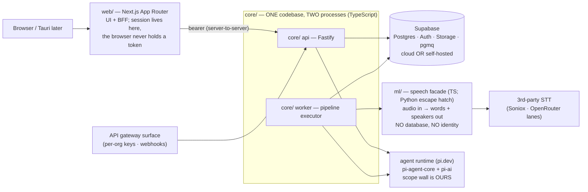

# Echo Platform — Architecture (DRAFT 2 — in review)

> **Echo (اکو)** — the conversation-intelligence platform: calls and meetings
> become a searchable organizational memory with an agent that answers, built
> to be sold. Product behavior: [docs/SPEC.md](docs/SPEC.md). Decisions are
> numbered **M1…**; DRAFT until the user says locked. Repo:
> github.com/Dr-Bagheri/MVP (private). Brand family: the existing
> [Neurai Echo](https://github.com/Dr-Bagheri/Neurai-Echo) Android recorder
> shares the name; future path unifies it as Echo's mobile capture client.
> Predecessor lessons cited as (neurai-mvp: …) / (Echo app: …).

---

## M1 — The shape: four parts, three planes

- **web/** — Next.js App Router as UI + BFF: session server-side, browser
  never sees a token. Persian-first, bidirectional, fa + en interfaces.
- **core/** — identity, permissions, agent + tools, pipeline. One codebase,
  two processes (`api`, `worker`). Fastify. TypeScript, no exceptions.
- **ml/** — speech facade: audio in → words + speakers out. Stateless,
  productless, own upstream keys only. TypeScript by default; **Python
  permitted inside ml/ only** if Phase-0 measurement shows the Node speech
  tooling (diarization/VAD quality) measurably weaker — contract is
  language-neutral either way.
- **Supabase** — Postgres, Auth, Storage, pgmq. Cloud or self-hosted; same
  schema, same code, one env file of difference (M12).
- **Three planes, one rule**: control (identity/permissions/admin), work
  (pipeline transport), data (the record + rebuildable indexes). Anything
  with a fixed shape is plain code — no model in front of a known lookup.

## M2 — Tenancy: orgs first-class, individuals are orgs-of-one

Multi-tenant Postgres; every row carries `org_id`; RLS walls orgs from each
other and enforces the two call scopes (private / org). **Individuals and
organizations are both customers — an individual is an org-of-one in the
schema, no special case.** Target scale v1: multiple orgs × dozens of users.
Single-tenant per-customer deployment (their own Supabase) is the same schema
with one org — a deployment choice, not a fork.

## M3 — The permission stack (defense in depth)

| Layer | Catches |
|---|---|
| JWT signature check (Supabase Auth) | forged identity |
| one connection factory — the ONLY way to get a DB handle, identity required | queries with no user attached |
| the app's WHERE clauses | the normal, correct path |
| **RLS policy** | every bug in the layers above |
| **Postgres role grants** | writes/deletes no code path should ever perform |

- Identity can be built **from a row as well as a token** — pipeline jobs run
  as the call's owner, never as a service account.
- The agent's DB role has **no DELETE grant** anywhere; column-level grants
  narrow single-field tools (Echo app precedent: speaker-rename grant).

## M4 — The agent: Pi harness, our authority

- **pi.dev**: `@earendil-works/pi-agent-core` (loop, dispatch, state) +
  `@earendil-works/pi-ai` (unified providers, model discovery) — v0.84.x, MIT,
  verified. Pi ships **no permission system by design; the scope wall is ours**,
  written as an extension around it — the one part never bought.
- **One runtime for every agent** — user assistant and pipeline summarizer are
  the same code with different toolsets, run as a person (asker or call owner).
- All harness contact behind one interface file.
- **Agents are configuration**: prompt + model + tool list stored as data →
  skills editable without deploys (system < org < user; most specific wins).
- One tool wrapper: scopes every call to the caller, records everything into
  `agent_runs` (replayable). Domain tools only — never shell/filesystem.
- **Assistant scope** [user ruling]: answers ANY question over ALL data the
  caller can reach — their calls, org-scoped calls, everything for admins —
  and never one row more. Same runtime, same wall.
- Prompt-injection posture: instructions never come from data; content enters
  prompts quoted; inferred writes are proposed first (approval card in the UI —
  Echo app's confirm pattern); tool scoping + role grants bound the blast
  radius.

## M5 — Models: all cloud, user-chosen, admin-curated, no Claude

- **No local LLMs, no Ollama, no air-gapped profile** (user decision —
  deliberate reversal of neurai-mvp D14/D15).
- **No default model.** Each user picks from the catalogue (tool-capable
  only). The UI's pre-selected *suggestion* is the strongest model for our
  domain + Persian — a ranking the steward maintains by eval (currently the
  Gemini Pro line per published Persian benchmarks).
- **Claude is excluded from the catalogue** (user directive).
- **Admins curate**: per-org allow-list controls which models members see
  (also the cost lever, since usage has no product UI — M15).
- Providers via `pi-ai` with **OpenRouter** for breadth/catalogue; direct
  provider lanes addable behind the same interface.

## M6 — Speech: API-first behind ml/, diarization local, Persian-focused

- Transcription: **Soniox** primary candidate (word-level timestamps, strong
  Persian, streaming exists though v1 doesn't use it) + OpenRouter ASR lanes;
  self-hosted model later behind the same contract. Provider choice settles by
  bake-off on real Persian recordings (both predecessors' discipline).
- **Word-level timestamps required** (click-a-word seeks; words align to
  speakers). (Echo app: proportional estimates were a visible quality gap.)
- **Languages**: Persian primary; incidental English inside Persian calls
  handled by the STT. UI in fa + en; **summaries always Persian** [user ruling].
- Diarization local in ml/ (ONNX on CPU; whole-file clustering, tunable
  threshold). Two-channel audio → speakers from channels, no diarization.
- VAD (Silero, ONNX): trims silence before paid STT; utterance boundaries.
- ffmpeg transcodes **any audio format** [user ruling] to pipeline format.

## M7 — Recording model & pipeline (DAG on pgmq)

- **No live transcription in v1** [user ruling].
- **30-minute parts** [user ruling]: a session longer than 30 min auto-splits;
  each ≤30-min part is its own audio file, all parts belong to ONE call with
  ONE title and a continuous timeline. Schema: `calls → parts → transcript
  rows`. Browser capture writes parts crash-safe as it goes; upload of part N
  starts while N+1 records.
- DAG per part: `upload → transcode → vad → transcribe → diarize` ; per call:
  `→ link-speakers → summarize → ready` (summary spans all parts).
- Status column IS the position; one step per queue message; every step
  idempotent (checks its artifact, not a done flag); retries with backoff →
  dead-letter; a failed call is visibly failed and resumable. (Echo app
  lessons: race-safe claiming, orphan requeue on worker start,
  missing-part skip-with-gap rather than whole-call failure.)
- The DAG invokes the agent as an ordinary function call, as the call's owner.

## M8 — Data & retrieval

- **Schema in hand-written SQL** (numbered migrations); Drizzle for queries
  only — generators can't emit RLS/roles/grants and would silently drop the
  security layer.
- **Transcripts: one segment per row** (search, windows, surgical corrections).
- **Search**: Postgres FTS (`tsvector`) over transcripts + summaries; RLS
  filters by construction. Persian normalization (TS port of `fa_normalize`)
  at ingest AND query. Search returns **offsets, not content**; the agent
  expands the windows it wants — context is the budget.
- **pgvector reserved** for the Projects/wiki layer — don't embed what you can
  look up exactly.
- `jsonb` for tool payloads (`agent_runs`), skill definitions, version metadata.
- Versioned summaries (pointer moves, versions survive); corrected lines keep
  identity + edited mark; roster edits are change-lists.

## M9 — Language & stack

| Concern | Choice |
|---|---|
| Language | **TypeScript-first**; Python only inside ml/ if measurement demands (M1) |
| web/ | Next.js App Router · next-intl (fa default + en) · RTL-first · Vazirmatn · ui-ux-pro-max-driven design system |
| core/ | Fastify · pnpm workspaces · zod at every boundary · pino (no content in logs) · SSE streaming |
| ORM | Drizzle (queries); SQL owns structure |
| Queue | pgmq |
| Tests | Vitest · **SQL test suite for RLS/grants** (the wall gets its own tests) · Playwright E2E |
| Desktop | Tauri wrapper, phase 1.5 (same Next.js app; native capture stays out per spec) |

## M10 — Security completeness (the sellable bar)

Signed URLs for all audio; private buckets; TLS (nginx); CSP + security
headers; zod everywhere; secrets in env/secret stores only (publisher-enforced,
as in all our repos); audit = `agent_runs` + admin action log; structured
no-content logs; OpenTelemetry/error-tracking seams; scheduled `pg_dump` +
storage sync with a rehearsed restore drill. Spec-excluded items (SSO,
compliance suite, rate limiting, device revocation) stay excluded **with
designed seams** (M14).

## M11 — Access, deletion, retention [user rulings]

- Members see and manage **their own** calls (+ org-scoped ones read-only per
  spec's scope rules). Admins **read everything** in their org.
- **Admins may delete ANY recording — including members' private ones.**
  Members delete only their own. Human, plain-code paths, always logged.
- The **agent deletes nothing, ever** (role grant — M3).
- Steward default pending user veto: deletion = soft-delete with a 30-day
  purge window (visible to admins) — a sold product needs an undo story.

## M12 — Deployment profiles

1. **Local dev (CURRENT)**: everything on the user's machine — local
  processes + a dev Supabase project — until publish time [user ruling:
  host + domain chosen later].
2. **Cloud (launch)**: managed Supabase + core//ml/ containers + web/ on
  Vercel or same host.
3. **On-prem (per customer)**: self-hosted Supabase + same containers via one
  Docker Compose; models stay cloud (LLMs are online by decision — what moves
  on-prem is data at rest + the pipeline).

## M13 — Clients roadmap

v1 web/ (responsive) → v1.5 Tauri desktop → future: unify the Neurai Echo
Android app as Echo's mobile capture client (M18 brand family).

## M14 — Designed seams (excluded from v1, additive later)

Projects + per-project wiki (pgvector activates) · named connectors (catalogue
previews in v1; **the gateway ships in v1** — M17) · SSO · compliance suite ·
rate limiting · device revocation · agent long-term memory · billing wiring
(M15 leaves the states, not the payments).

## M15 — Monetization [user ruling]

One subscription = the whole package; no feature gating inside a paid plan.
**Self-serve = 1-day trial only** (anyone can sign up, full product, one day);
beyond that, accounts/orgs are **admin-provisioned**. Schema carries
`org.status` (trial/active/expired) + trial timestamps from day one; payment
processing itself is a later seam. **No usage view in the product** — internal
metering only, for our own cost visibility.

## M16 — (folded into M7: the 30-minute part model)

## M17 — Connectors & the API gateway [user ruling]

v1 ships a **public API gateway**: per-org API keys + webhooks so ANY
platform — including ones we haven't met — can push audio in and pull
transcripts/summaries/answers out ("a code or a link" integration). Gateway
requests carry the org identity and hit the same RLS wall as every other
path. The connectors catalogue (chat/CRM/documents/calendar/storage) ships as
preview; named connectors are later built ON the gateway. MCP is the likely
transport for agent-side connectors when they arrive.

## M18 — Name: Echo (اکو) [user decision]

One brand family with the Android recorder. Steward flag on record: global
trademark adjacency (Amazon Echo) — irrelevant to the current market, revisit
only if Western registration ever matters.

---

## Invariants (locked)

1. The transcript is the source of truth; everything else derived + rebuildable.
2. No DB access without a user identity attached.
3. The agent holds no authority of its own; instructions never come from data.
4. Derived artifacts record provenance; version stamps cannot be backfilled.
5. Agent runs are replayable.
6. ml/ is productless: no DB, no identity, no product credentials.
7. Secrets never in the repo; content never in logs.

## §OPEN — for the next review round

1. **Soft-delete window** (M11): accept the 30-day purge default, or true
   immediate deletion?
2. **Trial abuse posture**: 1-day self-serve trial with no rate limiting
   (excluded by spec) — accept minimal signup friction (email verification +
   one-trial-per-email) as the only guard?
3. **Speaker directory privacy**: do voices from PRIVATE calls join the org's
   shared speaker directory automatically, or only when the owner links them?
4. **Phase 0 spike approval**: 1 day proving Pi-with-our-wall, Soniox Persian
   word-timestamps, and Node diarization quality (decides the ml/ language)
   before full build dispatch.
5. **Anything you want changed in this draft** — next pass folds it in.
