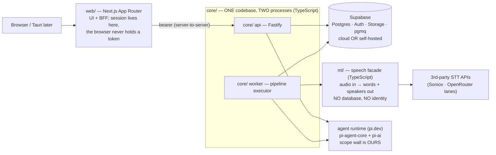

# MVP — Architecture (DRAFT 1 — for review round 2 with the user)

> The commercial rebuild. Product behavior lives in [docs/SPEC.md](docs/SPEC.md);
> this document is the technical shape. Decisions are numbered **M1…** and get
> locked only after our review rounds. §OPEN lists what still needs the user.
> Predecessors: [neurai-mvp](https://github.com/Dr-Bagheri/neurai-mvp) (on-prem
> platform, D1–D15) and [Neurai-Echo](https://github.com/Dr-Bagheri/Neurai-Echo)
> (cloud recorder, E1–E7) — lessons from both are cited where they shaped a choice.

---

## M1 — The shape: four parts, three planes

- **web/** — Next.js App Router as UI + BFF: holds the session server-side;
  the browser never sees a token. Persian-first i18n, bidirectional layout.
- **core/** — the application: identity, permissions, the agent and its tools,
  the pipeline. One codebase, two processes: `api` (answers requests) and
  `worker` (does slow work). Fastify.
- **ml/** — a facade over speech: audio in, words + speakers out. Stateless,
  productless; holds only its own upstream API keys. *(Language: see M9 —
  TypeScript, resolving the spec's FastAPI mention against the no-Python rule.)*
- **Supabase** — Postgres, Auth, Storage, queue (pgmq). Managed cloud by
  default; **self-hostable on-premise** when a customer's data cannot leave
  the building (M12).

**Three planes, one rule** (from the spec): control plane (identity,
permissions, admin), work plane (pipeline transport), data plane (the record +
derived indexes that can be rebuilt). Anything with a fixed shape skips the
agent — a model in front of a known lookup buys latency and nothing else.

## M2 — Tenancy: one database, org-walled by RLS

Multi-tenant Postgres: every row carries `org_id`; **RLS policies enforce org
isolation and the private/org call scopes**. Two roles (member, admin), two
scopes (private, org) — exactly the spec, no more. Per-customer single-tenant
deployment (their own Supabase) is the SAME schema with one org — deployment
choice, not code fork. *(Echo lesson: RLS as the wall worked; neurai-mvp
lesson: data-layer enforcement is the only enforcement that counts.)*

## M3 — The permission stack (defense in depth)

| Layer | Catches |
|---|---|
| JWT signature check (Supabase Auth) | forged identity |
| one connection factory — the ONLY way to get a DB handle, identity required | queries with no user attached |
| the app's WHERE clauses | the normal, correct path |
| **RLS policy** | every bug in the layers above |
| **Postgres role grants** | writes/deletes that no code path should ever perform |

- A user identity can be built **from a row as well as from a token** — that's
  how a pipeline job runs as the call's owner instead of as a service account.
- The agent's DB role has **no DELETE grant** on calls/transcripts/summaries,
  and column-level grants where a tool may touch only one field *(Echo
  precedent: the speaker-rename column grant)*.

## M4 — The agent: Pi harness, our authority

- **pi.dev** is the harness: `@earendil-works/pi-agent-core` (loop, tool
  dispatch, state) + `@earendil-works/pi-ai` (unified provider API, model
  discovery) — both verified live at v0.84.x, MIT. Pi ships **no permission
  system by design; the scope wall is written by us as an extension around
  it** — that is exactly the part we should never buy.
- **One runtime for every agent** — user-facing assistant and pipeline
  summarizer are the same code with different toolsets. Two paths would mean
  two sets of permission bugs.
- All harness contact behind **one interface file** — replacing Pi touches one
  file.
- **An agent is configuration, not code**: prompt + model + tool list, stored
  as data → skills are editable without a deploy (system < organization < user,
  most specific wins).
- Every tool registers through **one wrapper** that scopes it to the caller and
  records the call into `agent_runs`. Domain tools only — never shell or
  filesystem. The DB grant, not the prompt, is the limit on writes.
- **Prompt-injection posture**: instructions never come from data; transcript
  content enters prompts as quoted material; the proposes-before-inferred-writes
  rule (spec) plus tool-level scoping bound the blast radius.

## M5 — Models: all cloud, user-selectable, provider-plural

- **No Ollama. No local LLMs. No air-gapped profile.** *(User decision —
  reverses neurai-mvp D14/D15; recorded deliberately.)*
- LLM: **Anthropic SDK** as the first-class lane behind the runtime interface,
  **OpenRouter** for the live model catalogue and routing breadth. `pi-ai`
  gives provider unification and model discovery.
- The **server-management screen** exposes provider/model choice per org
  (defaults) and per user (assistant model picker, tool-capable models only).
- Usage metering per call/agent/user/model (tokens + cost) — admin view.

## M6 — Speech: API-first behind ml/, diarization local

- **Transcription**: third-party STT via API first — **Soniox** (strong
  Persian claims; word-level timestamps; streaming available) and OpenRouter
  ASR lanes; our own hosted model later behind the same `ml/` contract, so a
  swap changes nothing upstream. Chunking, retries, provider quirks stay
  inside `ml/`.
- **Word-level timestamps are required** (click-a-word seeks audio; words
  align to speakers). *(Echo lesson: proportional estimates are a visible
  quality gap.)*
- **Diarization runs local in ml/** — voice clustering is a whole-file
  operation that can't chunk the way transcription does: **ONNX Runtime on
  CPU** (sherpa-onnx segmentation + speaker-embedding models). Threshold
  tunable against real recordings.
- **VAD** (Silero, ONNX) in `ml/`: trims silence before paid STT (cost),
  contributes utterance boundaries; the browser's live level-meter is UI-only.
- **Transcoding**: ffmpeg inside `ml/` (channels, sample rate, formats).
- Two-channel audio → speakers from channels, no diarization needed.

## M7 — Pipeline: a DAG on pgmq

`upload → transcode → (vad) → transcribe → diarize → link-speakers → summarize → ready`

- **The status column IS the graph position.** The next step derives from it —
  never stored beside it, so there is exactly one answer to "where is this
  call". UI progress = the status stream.
- **One step per queue message** — a crash costs one step, not the call.
- **Every step idempotent** (pgmq is at-least-once): each checks for the
  artifact it would produce, not a "done" flag. Retries with backoff;
  dead-letter after N failures; a failed call is visibly failed, resumable.
- The DAG calls agents **as ordinary function calls** — summarize is not a
  special AI path; it invokes the same runtime as the assistant, **as the
  call's owner**.
- New work = a new node, not more code in an existing step.
- *(Echo lessons carried: race-safe claiming, orphan requeue at worker start,
  missing-artifact steps skip-with-record instead of failing the call.)*

## M8 — Data & retrieval

- **Schema in hand-written SQL** (numbered migrations). Drizzle for queries
  only — generators cannot emit RLS policies, roles, or grants, and would
  silently drop the security layer. *(neurai-mvp precedent: numbered SQL was
  a steward-ratified deviation that paid off.)*
- **Transcripts: one segment per row** — optimal for search, indexing, windowed
  reads, and line-identity corrections.
- **Search**: Postgres FTS (`tsvector`) over transcripts + summaries, filtered
  by what the caller may see (RLS does the filtering by construction). Persian
  text goes through a normalization layer (TS port of `fa_normalize`: Arabic
  ي/ك → ی/ک, digit unification, ZWNJ handling) at ingest AND at query.
- **Search returns offsets, not content** — the agent expands the window it
  wants. Context is the budget.
- **Do not embed what you can look up exactly.** `pgvector` is reserved for the
  future structured-facts/projects layer; transcripts serve exact matching +
  context expansion in v1.
- `jsonb` for tool-call payloads in `agent_runs` (replayability), skill
  definitions, and version metadata.

## M9 — Language & stack rulings

| Concern | Choice |
|---|---|
| Everything | **TypeScript-first** (user rule, revised: Python permitted *only inside `ml/`* where it measurably wins — see below) |
| web/ | Next.js App Router (+ Tauri wrapper later, M13) |
| core/ | Fastify, one codebase / two processes, pnpm workspace — TypeScript, no exceptions |
| **ml/** | **TypeScript by default** — sherpa-onnx Node bindings (diarization), Silero-VAD ONNX, ffmpeg via managed binary. **Python escape hatch [user-granted]:** if the diarization/VAD quality or ecosystem in Node proves measurably weaker during Phase 0 validation, `ml/` (and only `ml/`) may be FastAPI/Python — the facade contract is language-neutral and productless either way, so nothing upstream moves. The decision is made by measurement on real Persian recordings, recorded here when taken. |
| ORM | Drizzle (queries only; schema is SQL) |
| Queue | pgmq (in Supabase; self-host parity) |
| Tests | Vitest (unit) · **RLS/grant test suite in SQL** (the security layer gets its own tests — non-negotiable) · Playwright (E2E) |
| Deploy | Docker Compose (core/, ml/, nginx); web/ on Vercel or the same compose for on-prem |

## M10 — Security completeness (the "sellable" bar)

Beyond M3: secrets only in env/secret store (never in repo — enforced by the
publisher pipeline as in prior projects); signed URLs for all audio access;
storage bucket private; TLS everywhere (nginx); security headers + CSP on
web/; zod validation on every API boundary; audit surface = `agent_runs` (every
tool call) + admin action log; structured logs (pino) with **no content in
logs** *(house rule from both predecessors)*; error tracking + OpenTelemetry
seams. Backups: scheduled `pg_dump` + storage sync, documented restore drill.
**Spec-excluded items stay excluded** (SSO, compliance suite, rate limiting,
device revocation) — but each gets a designed seam so adding it is additive
(M14).

## M11 — i18n & Persian-first

`next-intl` (fa default, en secondary), full RTL layout, Vazirmatn, Persian
digits, Jalali-capable dates, `TextDirection`-correct mixed fa/en rendering.
The normalization layer (M8) is shared web/core. *(Direct carry-over of the
neurai-mvp D5 discipline, reimplemented in TS.)*

## M12 — Deployment profiles (the hybrid answer)

1. **Cloud (default)**: managed Supabase + core//ml/ containers on a VPS +
   web/ on Vercel. Models cloud (always).
2. **On-prem (per customer, when data can't leave)**: self-hosted Supabase +
   the same containers on their hardware via one Docker Compose; models still
   cloud (LLMs are online by decision). What moves on-prem is **data at rest
   + the pipeline** — the speed/locality wins — not the models.
3. Same schema, same code, one env file of difference.

## M13 — Clients roadmap

v1: **web/** (responsive). v1.5: **Tauri** desktop (Win/mac) wrapping the same
Next.js app — native menus/tray, no separate codebase (native *capture* stays
explicitly out per spec). Later: Tauri mobile evaluation. *(Echo's Android app
remains a separate product; no code sharing planned.)*

## M14 — Designed seams (excluded from v1, additive later)

Projects + per-project wiki (pgvector lights up here) · connectors (catalogue
ships as preview in v1) · SSO · compliance suite · rate limiting · device
revocation · agent long-term memory · billing/subscriptions (see §OPEN).

## Invariants (locked regardless of future rounds)

1. Transcript = source of truth; all else derived + rebuildable.
2. No DB access without a user identity attached.
3. The agent holds no authority of its own; instructions never come from data.
4. Derived artifacts record provenance; version stamps cannot be backfilled.
5. Agent runs are replayable.
6. `ml/` is productless: no DB, no identity, no product credentials.
7. Secrets never in the repo; content never in logs.

---

## §ROUND-2 — user rulings (2026-08-10, to be folded into the numbered decisions)

- **M15 (new) — Monetization**: one subscription = the whole package, no feature
  gating inside a paid plan. **Self-serve exists only as a 1-day trial** (anyone
  can sign up and test for one day); everything beyond the trial is
  **admin-provisioned**. Clients are BOTH individuals and organizations —
  an individual is an org-of-one in the schema (no special case). Billing
  wiring itself is later; the trial/provisioning states are v1.
- **M16 (new) — Recording model**: no live transcription in v1. **A recording
  session longer than 30 minutes auto-splits**: each ≤30-min part is its own
  audio file/segment, but all parts belong to ONE call group with ONE title —
  the schema gets calls → parts (files) → transcript rows, and the UI presents
  the group as a single object with a continuous timeline. Any audio format
  ffmpeg can read is accepted.
- **M17 (new) — Connectors & the API gateway**: v1 ships the connectors
  catalogue PLUS a **generic integration path**: a public API gateway with
  per-org API keys (and webhooks), so platforms we haven't built connectors
  for can push audio/pull results via "a code or a link" today. Named
  connectors get built on top of the same gateway later. Gateway calls carry
  an org identity and obey the same RLS wall as everything else.
- **M5 revision — Models**: **no default model.** Users choose their own from
  the catalogue (tool-capable only); the UI's pre-selected suggestion is the
  strongest model for our domain + Persian (steward maintains that ranking by
  eval, currently the Gemini Pro line per our published-benchmark research).
  **Claude is explicitly excluded from the catalogue** (user directive).
  **Admins decide which models their org's members can see.**
- **Usage view: DROPPED from v1** (spec's usage screen removed; internal
  metering still recorded for our own cost visibility, just no product UI).
- **Summaries: Persian, always.** Transcription: Persian-focused (fa primary;
  incidental English inside Persian calls handled by the STT). UI: fa + en.
- **Assistant scope**: must answer any kind of question over ALL data the
  asking user can reach (their calls; org-scoped calls; admins: everything) —
  never beyond the caller's permissions. Same one-runtime rule.
- **Deletion rights**: admin may delete ANY recording — including members'
  private ones (human, plain-code path, logged). Members delete only their
  own. The AGENT still can delete nothing (role grant unchanged).
- **Deployment for now**: develop and run everything on the user's machine
  (local Supabase or the dev cloud project + local processes); host + domain
  chosen at publish time. M12 gains a "local dev" profile as the current one.
- **API keys/access**: user will provide on request when build starts —
  needed list: Soniox key (new account), OpenRouter (existing or fresh for
  clean billing), new dedicated Supabase project. No Anthropic account needed
  (Claude excluded).

## §OPEN — remaining for review round 2 (user input needed)

1. **Billing/monetization**: design the Stripe-shaped seam now (orgs, seats,
   usage) or literally nothing in v1? Usage metering exists either way.
2. **Org onboarding**: self-serve signup (anyone creates an org) vs
   provisioned-only (we/admins create orgs)? Changes auth flows.
3. **Live captions during browser recording**: Soniox streams — do we want a
   live transcript preview in v1, or record-then-process only (spec reads as
   the latter)?
4. **Name**: the product needs one (repo is "MVP"). Branding round with
   ui-ux-pro-max?
5. **Hosting targets**: Vercel + which VPS/host for core//ml/? (Cost/latency/
   reachability trade — Hetzner EU default?)
6. **Email**: transactional provider for auth mails (avoid Echo's rate-limit
   trap) — Resend/Postmark/own SMTP?
7. **The spec's "deleting removes it"** vs the agent's no-delete rule: human
   delete is real deletion (owner/admin via plain code) — confirm retention
   stance for a commercial product (soft-delete window?).
8. **Model catalogue source of truth**: OpenRouter listing filtered to
   tool-capable, plus Anthropic direct — confirm; and which models are the
   shipped defaults per task (assistant vs summarizer)?
