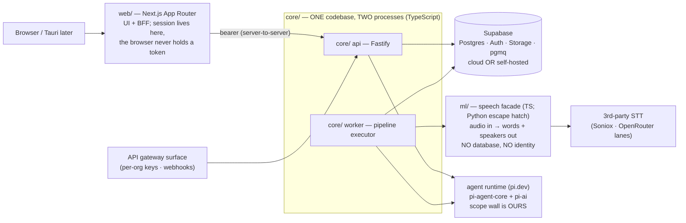

# Echo Platform — Architecture (v1.0 — LOCKED 2026-08-12)

> **Echo (اکو)** — the conversation-intelligence platform: calls and meetings
> become a searchable organizational memory with an agent that answers, built
> to be sold. Product behavior: [docs/SPEC.md](docs/SPEC.md). Decisions are
> numbered **M1…** and are **LOCKED (user, 2026-08-12)** — binding on every
> session; deviations go to the steward and are amended here BEFORE code. Repo:
> github.com/Dr-Bagheri/MVP (private). Brand family: the existing
> [Neurai Echo](https://github.com/Dr-Bagheri/Neurai-Echo) Android recorder
> shares the name; future path unifies it as Echo's mobile capture client.
> Predecessor lessons cited as (neurai-mvp: …) / (Echo app: …).

---

## M1 — The shape: four parts, three planes

- **web/** — Next.js App Router as UI + BFF: session server-side, browser
  never sees a token. Persian-first, bidirectional, fa + en interfaces.
- **core/** — identity, permissions, agent + tools, pipeline. One codebase,
  two processes (`api`, `worker`). Fastify. TypeScript, no exceptions.
- **ml/** — speech facade: audio in → words + speakers out. Stateless,
  productless, own upstream keys only. **[RULED by Phase-0 measurement]:
  TypeScript CONFIRMED** — sherpa-onnx-node installed prebuilt on Windows
  (no Python/node-gyp), OfflineSpeakerDiarization + Vad in one dep, clean
  clustering on synthetic ground truth (auto-cluster found 2/2 speakers,
  179/180 alternations on an 11-min file) and confirmed on real Persian
  audio (1-speaker clip → exactly 1 speaker found, no invented voices; the
  multi-speaker gate closes on the first real 2-voice recording).
  **RTF caveat (honest correction)**: the measured 0.41× was an idle-machine
  best case — under build-load contention the same file measured ~2× — so
  pipeline sizing happens on target hardware under representative
  concurrency, not from spike numbers. What survives: diarization is the
  heaviest CPU stage and gets its own worker concurrency budget.
  The Python hatch stays documented but UNUSED; if a measured gap appears on
  real Persian recordings, the fix is likely a different ONNX model, not a
  different language (same models either way). Confirmation gate: re-run the
  spike's diarize harness on the first real recording.
- **Supabase** — Postgres, Auth, Storage, pgmq. Cloud or self-hosted; same
  schema, same code, one env file of difference (M12).
- **Three planes, one rule**: control (identity/permissions/admin), work
  (pipeline transport), data (the record + rebuildable indexes). Anything
  with a fixed shape is plain code — no model in front of a known lookup.

## M2 — Tenancy: orgs first-class, individuals are orgs-of-one

Multi-tenant Postgres; every row carries `org_id`; RLS walls orgs from each
other and enforces the two call scopes (private / org). **Individuals and
organizations are both customers — an individual is an org-of-one in the
schema, no special case.** Target scale v1: multiple orgs × dozens of users.
Single-tenant per-customer deployment (their own Supabase) is the same schema
with one org — a deployment choice, not a fork.

## M3 — The permission stack (defense in depth)

| Layer | Catches |
|---|---|
| JWT signature check (Supabase Auth) | forged identity |
| one connection factory — the ONLY way to get a DB handle, identity required | queries with no user attached |
| the app's WHERE clauses | the normal, correct path |
| **RLS policy** | every bug in the layers above |
| **Postgres role grants** | writes/deletes no code path should ever perform |

- Identity can be built **from a row as well as a token** — pipeline jobs run
  as the call's owner, never as a service account.
- The agent's DB role has **no DELETE grant** anywhere; column-level grants
  narrow single-field tools (Echo app precedent: speaker-rename grant).

## M4 — The agent: Pi harness, our authority

- **pi.dev**: `@earendil-works/pi-agent-core` (loop, dispatch, state) +
  `@earendil-works/pi-ai` (unified providers, model discovery) — v0.84.x, MIT.
  **[Phase-0 verified live]**: embeds cleanly; ships no permission *system*
  but first-class mount points — `beforeToolCall`/`afterToolCall` in
  AgentLoopConfig where `{block:true, reason}` vetoes a call before execution
  — so the wall is our central policy at Pi's hook + our identity-carrying
  tool wrapper (belt and suspenders; measured: hostile prompt → 2/4 calls
  denied, identical denial shapes, foreign content never entered the
  transcript). Mid-session model swap works (`prepareNextTurn`). Build notes
  (Phase-0 friction, binding on core/): ESM-only; **LLM errors are IN-BAND**
  (`stopReason:"error"` on a normal-looking empty answer) — the runtime MUST
  surface message_end errors explicitly or failures look silent; reasoning-
  mandatory models (gemini-3.x) need `reasoning:"low"` passed — the catalogue
  carries a per-model flag; use `builtinModels()`, never hand-rolled
  createProvider.
- **One runtime for every agent** — user assistant and pipeline summarizer are
  the same code with different toolsets, run as a person (asker or call owner).
- All harness contact behind one interface file.
- **Agents are configuration**: prompt + model + tool list + optional
  per-skill tool-call ceiling (`max_tool_calls`, nullable → runtime default
  when unset) stored as data → skills editable without deploys (system <
  org < user; most specific wins). [Ceiling ruled 2026-08-12 — the field
  briefly outran the document; a heavy research skill and a two-call recap
  deserve different budgets, and the ceiling is part of what an admin
  configures.]
- One tool wrapper: scopes every call to the caller, records everything into
  `agent_runs` (replayable). Domain tools only — never shell/filesystem.
- **Assistant scope** [user ruling]: answers ANY question over ALL data the
  caller can reach — their calls, org-scoped calls, everything for admins —
  and never one row more. Same runtime, same wall.
- Prompt-injection posture: instructions never come from data; content enters
  prompts quoted; inferred writes are proposed first (approval card in the UI —
  Echo app's confirm pattern); tool scoping + role grants bound the blast
  radius.

## M5 — Models: all cloud, user-chosen, admin-curated, no Claude

- **No local LLMs, no Ollama, no air-gapped profile** (user decision —
  deliberate reversal of neurai-mvp D14/D15).
- **No default model.** Each user picks from the catalogue (tool-capable
  only). The UI's pre-selected *suggestion* is the strongest model for our
  domain + Persian — a ranking the steward maintains by eval (currently the
  Gemini Pro line per published Persian benchmarks).
- **Claude is excluded from the catalogue** (user directive).
- **Admins curate**: per-org allow-list controls which models members see
  (also the cost lever, since usage has no product UI — M15).
- Providers via `pi-ai` with **OpenRouter** for breadth; **the catalogue
  source is `pi-ai`'s `builtinModels()`** (Phase-0: 39 providers / 335
  OpenRouter models generated) — we FILTER (tool-capable, no Claude, per-org
  admin allow-list, reasoning-mandatory flag) rather than build.
- **[AMENDED 2026-08-12, steward] Unattended runs resolve a model by
  ladder** — "no default model" is a rule about a person choosing, and the
  pipeline summarizer runs for an owner who may never have opened settings:
  owner's preferred model → org summarizer default (v1 stand-in: first
  entry of the admin allow-list, documented as deliberate) → operator env
  fallback → and when nothing resolves, the summary is **skipped with a
  visible, retryable flag**. A missing model may cost a summary, never a
  call — the transcript is the record (invariant 1), and the summarize step
  re-queues once a model exists.

## M6 — Speech: API-first behind ml/, diarization local, Persian-focused

- Transcription: **Soniox PRIMARY — ratified by measurement on the user's
  real clip (2026-08-12)**: 0.12× realtime, every token timestamped and
  monotonic, correct ZWNJ and colloquial register, natural fa/en
  code-switching; proper nouns are the known weak spot. **Integration
  requirement**: Soniox returns SUB-WORD tokens — ml/'s adapter MUST assemble
  words via the leading-space convention (new word per space-prefixed token,
  start from first token, end from last, speaker survives assembly) or the UI
  receives unclickable fragments. OpenRouter ASR lane: fallback only —
  measured on the same clip: near-identical text quality but **zero
  timestamps and zero speakers** (structurally, via chat completions), and
  ~10× the token cost.
- **Word-level timestamps required** (click-a-word seeks; words align to
  speakers). (Echo Mobile: proportional estimates were a visible quality gap.)
- **[Steward ruling, refined by head-to-head measurement]** The fallback
  lane produces NO timings at all. Policy when the primary is down:
  **degrade-and-flag, never lose the call** — the result carries
  `timestamps: "none"` provenance end-to-end; the UI shows the transcript
  with seek DISABLED and the degraded flag visible; the call queues for
  automatic re-transcription when the primary recovers. Silent degradation
  and total failure both forbidden.
- **Soniox diarizes natively** (async, per-token speakers, up to 15) — local
  diarization (sherpa-onnx or the Python hatch) is the fallback for lanes
  without it, plus the independence hedge, behind ml/'s Diarizer interface.
- **Languages**: Persian primary; incidental English inside Persian calls
  handled by the STT. UI in fa + en; **summaries always Persian** [user ruling].
- Diarization local in ml/ (ONNX on CPU; whole-file clustering, tunable
  threshold). Two-channel audio → speakers from channels, no diarization.
- VAD (Silero, ONNX): trims silence before paid STT; utterance boundaries.
- ffmpeg transcodes **any audio format** [user ruling] to pipeline format.

## M7 — Recording model & pipeline (DAG on pgmq)

- **No live transcription in v1** [user ruling].
- **30-minute parts** [user ruling]: a session longer than 30 min auto-splits;
  each ≤30-min part is its own audio file, all parts belong to ONE call with
  ONE title and a continuous timeline. Schema: `calls → parts → transcript
  rows`. Browser capture writes parts crash-safe as it goes; upload of part N
  starts while N+1 records.
- DAG per part: `upload → transcode → vad → transcribe → diarize` ; per call:
  `→ link-speakers → summarize → ready` (summary spans all parts).
- Status column IS the position; every step idempotent (checks its artifact,
  not a done flag); retries with backoff → dead-letter; a failed call is
  visibly failed and resumable. (Echo app lessons: race-safe claiming, orphan
  requeue on worker start, missing-part skip-with-gap rather than whole-call
  failure.)
- **[AMENDED 2026-08-12, steward + Backend 2]** Queue transport ≠ status
  ladder: ml/'s `/process` performs transcode/vad/transcribe/diarize in ONE
  approved call, so the per-part rungs ride ONE queue message
  (`process_part`) that walks the status ladder — the per-part statuses stay
  as the progress positions, but "one step per queue message" holds only for
  the per-call steps (`link_speakers`, `summarize`). Retry re-pays STT only
  in the narrow crash window between a successful ml/ response and the DB
  write — judged acceptable against splitting ml/'s facade into four
  stateful endpoints (invariant 6). The three unused per-part queues from
  db/0017 are dropped in db/0019 rather than left as a pipeline-shaped lie
  (0021 retires the last; the suite asserts the exact inventory AND that no
  retired name returns).
- **Enqueue contract (security-relevant, promoted from db/0021's record):**
  every job payload carries `{callId, ownerId, partId}` where **`ownerId`
  must be written by the enqueuer while a genuine caller is present** — it
  is how M3's "pipeline jobs run as the call's owner, never as a service
  account" survives contact with a queue. The worker resolves identity FROM
  the payload, re-reads the call as that owner, and fails closed if it isn't
  visible; there is no privileged lookup for a job to fall back on. This
  contract lives in JSON, not in the schema — which is exactly why it is
  recorded here.
- The DAG invokes the agent as an ordinary function call, as the call's owner.

## M8 — Data & retrieval

- **Schema in hand-written SQL** (numbered migrations); Drizzle for queries
  only — generators can't emit RLS/roles/grants and would silently drop the
  security layer.
- **Transcripts: one segment per row** (search, windows, surgical corrections).
- **Search**: Postgres FTS (`tsvector`) over transcripts + summaries; RLS
  filters by construction. Persian normalization (TS port of `fa_normalize`)
  at ingest AND query. Search returns **offsets, not content**; the agent
  expands the windows it wants — context is the budget.
- **pgvector reserved** for the Projects/wiki layer — don't embed what you can
  look up exactly.
- `jsonb` for tool payloads (`agent_runs`), skill definitions, version metadata.
- Versioned summaries (pointer moves, versions survive); corrected lines keep
  identity + edited mark; roster edits are change-lists.

## M9 — Language & stack

| Concern | Choice |
|---|---|
| Language | **TypeScript-first**; Python only inside ml/ if measurement demands (M1) |
| web/ | Next.js App Router · next-intl (fa default + en) · RTL-first · Vazirmatn · ui-ux-pro-max-driven design system |
| core/ | Fastify · pnpm workspaces · zod at every boundary · pino (no content in logs) · SSE streaming |
| ORM | Drizzle (queries); SQL owns structure |
| Queue | pgmq |
| Tests | Vitest · **SQL test suite for RLS/grants** (the wall gets its own tests) · Playwright E2E |
| Desktop | Tauri wrapper, phase 1.5 (same Next.js app; native capture stays out per spec) |

## M10 — Security completeness (the sellable bar)

Signed URLs for all audio; private buckets; TLS (nginx); CSP + security
headers; zod everywhere; secrets in env/secret stores only (publisher-enforced,
as in all our repos); audit = `agent_runs` + admin action log; structured
no-content logs; OpenTelemetry/error-tracking seams; scheduled `pg_dump` +
storage sync with a rehearsed restore drill. Spec-excluded items (SSO,
compliance suite, rate limiting, device revocation) stay excluded **with
designed seams** (M14).

**Storage access model [promoted from the ops checklist, 2026-08-12]:**
`storage.objects` carries RLS enabled with **zero policies — deliberately,
permanently**. With no policy, nothing reaches an object except the service
key, which is the whole model: core/ mints short-lived signed URLs
server-side and no client ever talks to storage under its own authority. A
policy added here to "make uploads work" would silently swap signed-URL
access for client-side access — a different security model wearing the same
clothes. If an upload seems to need a policy, the missing piece is a signer,
not a policy.

## M11 — Access, deletion, retention [user rulings]

- Members see and manage **their own** calls (+ org-scoped ones read-only per
  spec's scope rules). Admins **read everything** in their org.
- **Admins may delete ANY recording — including members' private ones.**
  Members delete only their own. Human, plain-code paths, always logged.
- The **agent deletes nothing, ever** (role grant — M3).
- **[Ratified round 3]** Deletion = soft-delete with a **30-day purge
  window** (visible to admins), then hard purge of audio, transcript, and
  derived data together.
- **Speaker directory privacy [user ruling]**: voices from private calls do
  NOT enter the org's shared speaker directory automatically — they join only
  when the **owner links** the voice (or records/uploads with linking). The
  directory is built from deliberate acts, never from passive capture.

## M12 — Deployment profiles

1. **Local dev (CURRENT)**: everything on the user's machine — local
  processes + a dev Supabase project — until publish time [user ruling:
  host + domain chosen later].
2. **Cloud (launch)**: managed Supabase + core//ml/ containers + web/ on
  Vercel or same host.
3. **On-prem (per customer)**: self-hosted Supabase + same containers via one
  Docker Compose; models stay cloud (LLMs are online by decision — what moves
  on-prem is data at rest + the pipeline).

## M13 — Clients roadmap

v1 web/ (responsive) → v1.5 Tauri desktop → future: unify the Neurai Echo
Android app as Echo's mobile capture client (M18 brand family).

## M14 — Designed seams (excluded from v1, additive later)

Projects + per-project wiki (pgvector activates) · named connectors (catalogue
previews in v1; **the gateway ships in v1** — M17) · SSO · compliance suite ·
rate limiting · device revocation · agent long-term memory · billing wiring
(M15 leaves the states, not the payments).

## M15 — Monetization & access [user rulings, revised round 3]

One subscription = the whole package; no feature gating inside a paid plan.
**No trial of any kind.** Access model: a person can **register themselves**
— username + password, or **one-click Google (Gmail) sign-up** (OAuth) — but
the account sits in a **pending state until an admin accepts it**. Nothing is
visible or usable before acceptance. Schema: `user.status`
(pending/active/disabled) + `org.status` (active/suspended); payment
processing is a later seam. **No usage view in the product** — internal
metering only, for our own cost visibility.
**[Amendment, schema round]**: acceptance is two-tier — members joining an
EXISTING org are accepted by that org's admin; a self-registered NEW org
(including org-of-one individuals) is accepted by **the vendor** — acceptance
is the commercial gate. v1 ships a minimal vendor acceptance procedure (not a
console). Ratified with it: the current-summary pointer moves only via a
SECURITY DEFINER trigger (the agent holds zero grants on echo.call), and
**assistant conversations are private even from admins** — the admin audit
surface is agent_run (what the agent did), never colleagues' conversation text.

## M16 — (folded into M7: the 30-minute part model)

## M17 — Connectors & the API gateway [user ruling]

v1 ships a **public API gateway**: per-org API keys + webhooks so ANY
platform — including ones we haven't met — can push audio in and pull
transcripts/summaries/answers out ("a code or a link" integration). Gateway
requests carry the org identity and hit the same RLS wall as every other
path. The connectors catalogue (chat/CRM/documents/calendar/storage) ships as
preview; named connectors are later built ON the gateway. MCP is the likely
transport for agent-side connectors when they arrive.

**[AMENDED 2026-08-12, steward]** Two rulings from the build:

- **Assistant access is per-key opt-in.** A key reaching
  `POST /v1/assistant/ask` spends model tokens without bound, and v1 ships
  no rate limiter (M10/M14 seam — a real limiter is a design decision, not
  a patch). So `api_key.allow_assistant` (default **false**, db/0022): a
  leaked or runaway key can pull transcripts, not drain a model budget,
  unless an admin deliberately granted it answers. Fits M5's
  admin-as-cost-lever; the enthusiastic-but-authorized integration stays
  the admin's accepted risk until the M14 limiter exists. **A key's
  capabilities are immutable once issued** (ratified from the build):
  granted at mint, no PATCH — changing capability means revoke + reissue,
  so the audit reads "one credential ended, a different one began" rather
  than a key whose meaning depends on when you looked.
- **Webhook bodies carry identifiers and status ONLY** — `{event, call_id,
  org_id, occurred_at, status}`; never a title, never text, never a speaker
  name. The consumer comes back through the gateway to read content, under
  the wall and in the audit trail. This is an **invariant** (the outbound
  twin of "content never in logs"), not a convention — a "just include the
  title, it's convenient" change is a security regression, not polish.

## M18 — Name: Echo (اکو) [user decision]

One brand family with the Android recorder — which is referred to as **Echo Mobile** everywhere (docs, conversation, UI copy) so that plain **Echo** always means this platform. Steward flag on record: global
trademark adjacency (Amazon Echo) — irrelevant to the current market, revisit
only if Western registration ever matters.

## M19 — Database decisions ratified [steward, 2026-08-12, post-lock amendment]

`db/` shipped with its own numbered decisions (db/DECISIONS.md D1–D13); after
line-review of the SQL and a green 135-check suite against the dev project,
the steward **ratifies all thirteen** as the binding refinement of M2/M3/M8/
M11/M15/M17. The ones that constrain other packages, by name:

- **db/D2** — identity arrives as `SET LOCAL echo.actor_id` set by core/'s
  connection factory; setting that GUC IS authenticating.
- **db/D3** — `echo_app`/`echo_agent` hold no DELETE anywhere; `echo_purge` is
  the only deleting role and only past the 30-day window; `summary` and
  `admin_action` carry **no UPDATE grant for any role**.
- **db/D8** — exactly two SECURITY DEFINER doors reachable from core/
  (`register_account`, `resolve_api_key`); the vendor-acceptance pair is
  operator-only (`echo_vendor`, db/D13) and core/ cannot execute it.
- **db/D9** — composite FKs make cross-org references structurally impossible.
- **db/D11** — assistant sessions are private to their owner, admins included;
  the admin audit surface is `agent_run`, never conversation text.
- **db/D12** — pgmq queues created where pgmq exists; only `echo_app` may
  drive them. [AMENDED with M7 2026-08-12: one queue per part
  (`echo_process_part`) + one per per-call step; db/0019 drops the three
  per-part step queues 0017 created.]

Open questions ruled (steward): **Q2** as built — only an admin restores a
soft-deleted call; deletion feels like deletion to its owner. **Q3** as built —
any active member may rename directory entries; linking stays owner-only
(that is the privacy-bearing act, M11). **Q4** ratified — the "reads
everything, rewrites nothing" rule applies to human admins exactly as to the
agent. All three are cheap one-policy reversals if product experience argues
otherwise; user may override.

Post-review additions, same authority (0018): **db/D14** — a skill is
archived, never deleted (`archived_at`; live slugs unique via partial index
so a retired slug can be re-created; no role holds DELETE on `echo.skill`
because `agent_run` provenance must stay replayable). **Q5 ruled (v1)** — an
assistant conversation is the asker's own record: it survives the purge of a
call it discussed, with the run link cut (`on delete set null`). The
compliance-grade alternative (purging messages whose run pointed at the
purged call, in-transaction before the FK nulls) is expressible in the schema
and deferred with the rest of the compliance suite (SPEC: not v1). User may
override. Ratified with 0018: the D13 `current_user` seam now also governs
`tg_call_guard`'s ownership rules — a definer-path pointer move (no product
identity) is the operator seam, not a rewrite.

Model-integration testing rule (from ml/'s Silero finding, binding on every
package that wires a model): **a model wired up wrong usually fails silently
and passes negative tests** — every model integration must include at least
one assertion that something is positively detected on real data, and a
warning path when a component silently finds nothing. Second finding, same
family (sherpa-onnx CJS-under-ESM: a broken diarizer reported healthy):
**a health check must resolve the specific callable it guards** — probing a
module's presence is not a health check. Third, the fixture-independence
rule (CLAUDE.md rule 9): a test cannot fail when its fixture is derived from
the same belief as the implementation — at least one fixture per feature
must come from reality. Fourth, the altitude-of-fakes rule (CLAUDE.md rule
11, from the M15 401-bounce): when faking a COMPOSITION of access rules,
fake the rules, never the composition's output — the identity path is
tested against real RLS across {active, pending, suspended-org, unknown}. Running tally of structural choices that caught bugs
no test was looking for: composite FKs (db/D9); `UNIQUE (call_id, seq)` —
which surfaced the cross-part numbering collision on every >30-min call; and
`transcript_segment_words_is_array` — which turned double-JSON-encoding from
a silent corruption (every queue payload stored as a quoted string) into a
one-line diagnosis. Constraints are the tests you didn't know to write.

Runtime-boot corollary (worker E2E finding, strengthened by the api boot
smoke): core/ runs on `node --experimental-strip-types`, which strips
annotations but performs NO transforms — vitest transpiles fully, so **a
passing vitest suite is not evidence the process starts** (TS parameter
properties loaded 39-tests-green and refused to boot; api/main.ts did not
EXIST under 219 green tests, then silently exited 0 via a Windows-false
entrypoint guard — compare entrypoints with `pathToFileURL`, never string
equality). The milestone bar is therefore **starts under the production
runtime AND answers one request**, not "it loads". Diagnostics convention,
same finding: log Postgres's STRUCTURED error fields
(code/constraint/table/column), never message OR detail — both quote row
values, which can be transcript content (invariant 7); redact `detail` at
the logger level too, so it cannot arrive by another route.

## M20 — The timing ladder: word → line → part, never nothing [steward ruling, 2026-08-12]

Refines M6/M7; settles the frontend's degradation flag and the seek-to-zero
concern in one rule. Part-level timing always exists **structurally**
(`call_part.offset_ms` and `transcript_segment.start_ms/end_ms` are NOT NULL —
the schema cannot represent an untimed segment), so the degradation ladder is:

1. word timestamps (Soniox lane) → click a word;
2. segment timing only → click a line;
3. prose-only fallback (`provenance.stt.timestamps: "none"`) → ONE segment
   anchored to the **speech span** it came from (first speech → last speech
   within the part, which VAD knows even when the STT lane carries no
   timing); a click seeks to where the speech begins. Usually tighter than
   the part itself — a boundary-aligned stamp is the unusual case, not the
   rule. [WORDING CORRECTED 2026-08-12 to match the implemented contract;
   flagged by the frontend, verified against core/'s mapping code.]

Nothing is ever unclickable-because-untimed, and nothing silently seeks to 0.
Division of labour, deliberately: **ml/ stays productless** (invariant 6) —
its timings are 0-based within the audio it was handed; **core/'s worker**
anchors them (adds `part.offset_ms`) and synthesizes the anchored-span
segment on a timing-less result. core/ refuses to store a segment with
`end_ms <= start_ms` for a non-empty part — the "timing quietly became zero"
class dies at the boundary, not in the UI. A 200 from ml/ is not
automatically full fidelity: `degraded` + `timestamps:"none"` ride provenance
into storage; the UI's per-row `end_ms > start_ms` gate implements the ladder
unchanged, and the call-level «رونوشت با دقت کاهش‌یافته» chip stays a quality
signal, separate from seek mechanics.

Call-level summary field (contract, 2026-08-12): `transcript_timing:
"full" | "mixed" | "none" | null` — snake_case like every Call field;
**null when no transcript exists at all** (failed, deleted) because
`"none"` claims a prose-only transcript that is real — absent ≠ "none".
Always derived (per-part flags are the stored truth), and structurally
unusable as a gate: the per-row words are the only seek authority.

## M21 — The forfeit hierarchy: what the system may lose [steward, 2026-08-12]

Two packages arrived at the same sentence from opposite ends — "a missing
model may cost a summary, never a call" (M5) and "a moved contract may cost
fidelity, never a recording" (ml/ vocabulary drift) — which is what earns a
principle a number:

- **The system decides what it may lose, and the answer is never the user's
  data.** A missing model costs a summary; a moved contract costs fidelity;
  an unrecognised error costs a retry; a failed part costs a gap. In every
  case the derived artifact is forfeit and the record survives — the
  transcript is the record (invariant 1) and everything else is rebuildable.
- **Whatever is forfeited is said out loud** (rule 7): degrade-and-flag,
  `vad_found_no_speech`, `summary_skipped_reason`, `DEAD LETTER UNRECORDED`
  — one shape everywhere. Silent degradation is the failure; visible
  degradation is the design.
- **The boundary of the rule: degrade what the system INFERRED; fail on
  what the system was TOLD.** A model choice, a timing lane, a vocabulary
  version are inferences — losing one costs fidelity. A shipped system
  skill is a declaration: its absence can only mean broken configuration,
  and proceeding would launder a defect into a plausible artifact — a
  summary generated on the wrong prompt is worse than none *because it
  looks correct*. This is the asymmetry behind the loud-floor corollary,
  stated so the next person doesn't "fix" the inconsistency in either
  direction.
- Underneath all of it: **the user's recording is never what gets spent.**

---

## Invariants (locked)

1. The transcript is the source of truth; everything else derived + rebuildable.
2. No DB access without a user identity attached.
3. The agent holds no authority of its own; instructions never come from data.
4. Derived artifacts record provenance; version stamps cannot be backfilled.
5. Agent runs are replayable.
6. ml/ is productless: no DB, no identity, no product credentials.
7. Secrets never in the repo; content never in logs.

## Lock record

**LOCKED by the user, 2026-08-12**, after three review rounds and a measured
Phase-0 spike (Pi adopted with hook-based veto; ml/ ruled TypeScript by
benchmark; Soniox contract verified live). One measurement completes
post-lock without affecting any decision: Soniox Persian quality numbers on
the user's consented clip (lane validation inside the M6 design, not an
architecture variable). From here: amendments only via the steward, marked
and logged.
