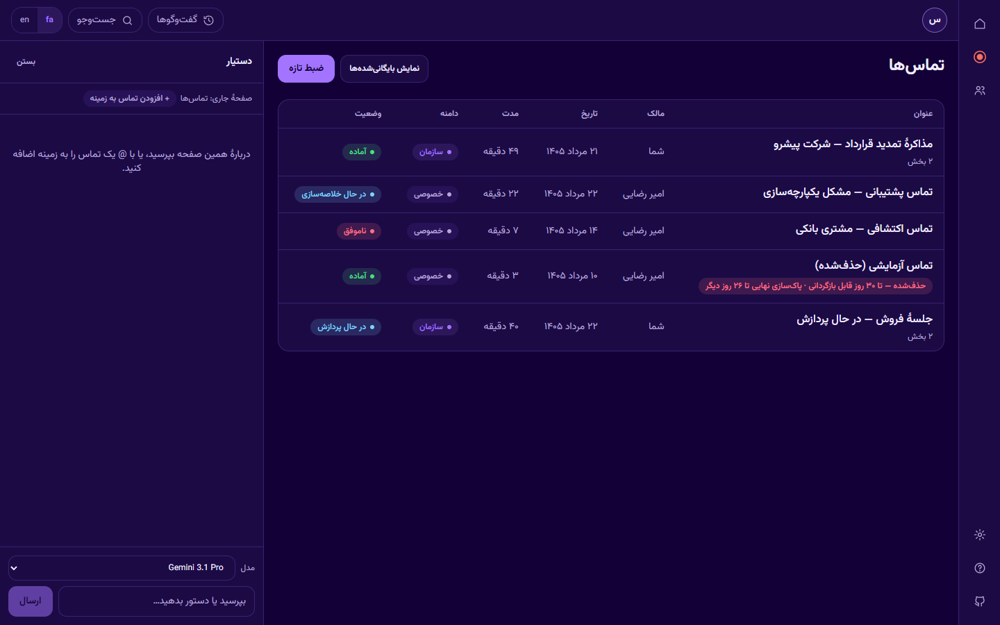
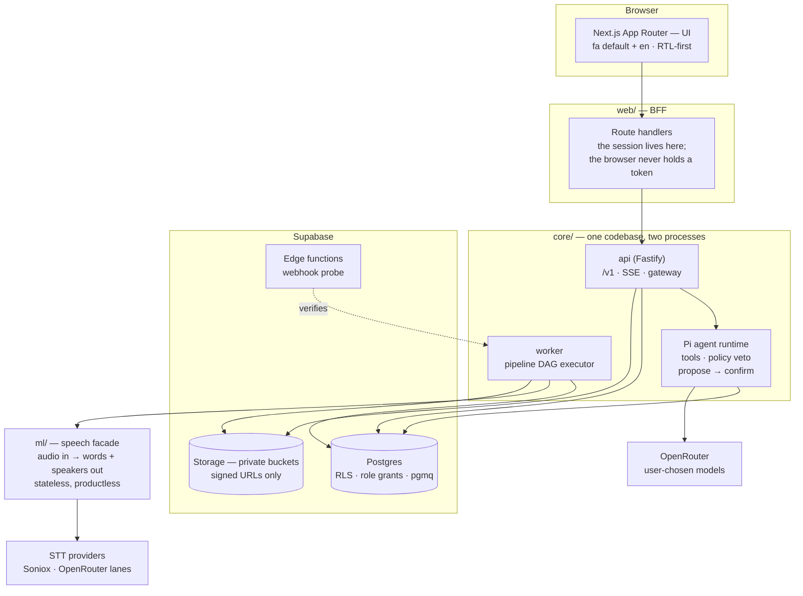
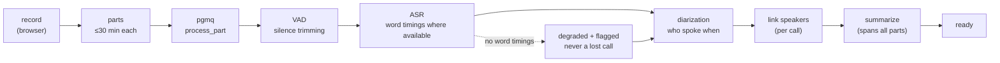

# NeurAI Platform

**An AI assistant platform for organizations — Persian-first, with the Echo
(اکو) call-intelligence app inside it.**

You talk to an assistant that can only see what *you* can see. Echo records
your calls and meetings, transcribes them in Persian, works out who said what,
and turns them into summaries you can question. Everything a user, an agent or
a job touches is bounded by the same permission wall — enforced in the
database, not in a prompt.

> **Status: private, pre-release.** The architecture is locked (v1.0, decisions
> M1–M25 in [ARCHITECTURE.md](ARCHITECTURE.md)); `db/`, `core/` and `ml/` are
> built and tested, `web/` is wiring the last milestone-4 surfaces. Nothing
> here is deployed for real users yet.

---

## What it does

| Surface | What you get |
|---|---|
| **Assistant hub** | The first page *is* the assistant: ask anything, get answers drawn from what you have access to. Conversations persist; history is reachable, never permanent chrome. |
| **Echo — record** | Browser capture that writes in 30-minute parts as it goes, so a crash costs one part, never the call. Part N uploads while N+1 records. |
| **Echo — calls** | Every call becomes a titled, summarized object: speaker-labelled transcript, word-level timing where the engine gives it, tap-to-seek. |
| **Ask your calls** | Grounded Q&A over transcripts with timestamp citations, plus write actions that go through a propose → you confirm → execute loop. |
| **User management** | Invitations, three roles (owner / admin / member), suspend, and a true-delete that actually removes a person, with a tombstone so the record of the deletion survives. |
| **Settings** | General · Security · SSO¹ · OAuth Apps (API keys + webhooks) · **Audit Logs** (real: admin actions, agent runs, proposal decisions) · Log Drains · Legal¹ |
| **Both languages** | Persian default and English, RTL-first, Vazirmatn, Persian digits, Jalali-capable dates — not a translation layer bolted on. |

¹ SSO and Legal Documents render as honest visible-but-inactive entries — named, not faked; their implementation is out of v1 scope.

## Screenshots

From the running shell with seeded demo data. The product is Persian-first, so
these are the Persian screens; the English locale is the same UI mirrored.

| Assistant hub — fa | Assistant hub — en |
|---|---|
|  |  |

| Echo — calls | Management · Users |
|---|---|
|  |  |

| Settings · General |
|---|
|  |

Two things worth noticing, because they are deliberate: **nothing is faked**.
A tile with no honest trend to show prints `—` and explains itself; a settings
entry that isn't built says so instead of pretending. And **the assistant
docks rather than takes over** — selecting an app keeps the app reachable at
every width, with no dialog to dismiss on arrival.

## Architecture

Four packages, three planes. The control plane owns identity and permissions,
the work plane moves jobs, the data plane holds the record and the indexes
that can be rebuilt from it. Full reasoning, decision by decision, in
[ARCHITECTURE.md](ARCHITECTURE.md).



**The wall is the database.** Every row carries `org_id`; RLS policies enforce
org isolation and private/org scope; role grants stop writes no code path
should perform (the agent's role has no `DELETE`). A pipeline job runs *as the
call's owner* — identity travels in the job payload, and the worker fails
closed if the call isn't visible to that identity. There is no service-account
back door.

### The pipeline



Every step is idempotent — it checks for its artifact, not a done flag — so a
retry is safe. Failures retry with backoff, then land in a dead-letter queue;
a failed call is *visibly* failed and resumable. When a transcription lane
can't carry word timestamps, the call degrades to line-level timing and says
so, rather than being lost (the timing ladder, M20).

## Stack

| Layer | Choice |
|---|---|
| Language | TypeScript everywhere (M9) |
| `web/` | Next.js App Router · next-intl · Tailwind · RTL-first · Vazirmatn |
| `core/` | Fastify · zod at every boundary · pino (no content in logs) · SSE |
| Agent | Pi (`pi-agent-core` + `pi-ai`) — the scope wall is ours, not the harness's |
| `ml/` | Soniox + OpenRouter STT lanes · Silero VAD · sherpa-onnx diarization |
| Data | Supabase Postgres · hand-written SQL migrations · RLS + role grants · Drizzle for queries only · pgmq |
| Tests | Vitest per package · a SQL suite that tests the wall itself · live acceptance runs |

## Repository layout

| Path | Contents |
|---|---|
| [`ARCHITECTURE.md`](ARCHITECTURE.md) | The source of truth — decisions M1–M25 with rationale |
| [`docs/SPEC.md`](docs/SPEC.md) | Product behaviour |
| [`db/`](db/) | Numbered SQL migrations, RLS/grant policies, and the suite that proves them |
| [`core/`](core/) | API, agent runtime, worker, gateway |
| [`ml/`](ml/) | The speech facade — audio in, words + speakers out |
| [`web/`](web/) | UI + BFF |
| [`brand/`](brand/), [`design-system/`](design-system/) | Marks, tokens, and the contrast gate |
| [`spike/`](spike/) | Phase-0 validation evidence (throwaway by design) |

---

## Running it

Everything below is reproducible on a clean machine with **your own** Supabase
project. No credential in this repo, ever — see [Secrets](#secrets).

### Prerequisites

- **Node ≥ 22** (the packages run TypeScript directly via
  `--experimental-strip-types`)
- **pnpm 9.12.3** — `corepack enable && corepack prepare pnpm@9.12.3 --activate`
- **Docker** — only if you want the local Postgres 17 instead of a Supabase project
- **Supabase CLI** — only for deploying edge functions
- **ffmpeg** on `PATH` — `ml/` shells out to it for transcoding

```bash
pnpm install
```

### Secrets

Credentials live in an OS-encrypted secret store (Windows DPAPI here) or your
environment — never in the repo, never in a file that git can see. The
platform's own credentials are namespaced `echo_platform_*` so they can't be
confused with a neighbouring project's:

| Name | Used by |
|---|---|
| `echo_platform_supabase_url` | everything |
| `echo_platform_supabase_secret_key` | `core/` server-side |
| `echo_platform_jwt_secret` | token verification |
| `echo_platform_db_url` | migrations (owner role) |
| `echo_platform_db_app_url` | `core/` api — the app role |
| `echo_platform_db_agent_url` | the agent role (no `DELETE` grant) |
| `echo_platform_db_purge_url` | the purge process |
| `echo_platform_supabase_access_token` | CLI / edge-function deploys |
| `openrouter_key`, `soniox_key` | provider keys (cross-product, canonical names) |

**Names only — the values are yours.** Put them in your store, or export the
equivalent environment variables (`DATABASE_URL`, `DATABASE_URL_AGENT`,
`OPENROUTER_API_KEY`, …) before starting a process. `ml/.env.example`
documents every `ml/` knob with empty slots; copy it to `.env.local`.

### Database

```bash
pnpm db:up          # local Postgres 17 in Docker on :55432 (skip if using Supabase)
pnpm db:migrate     # apply pending numbered migrations
pnpm db:test        # the RLS / role-grant / column-guard suite — the gate
node db/scripts/db.mjs test --fresh   # ...after rebuilding the schema from zero
```

`db:migrate` targets `DATABASE_URL` if set, otherwise the local container.
The suite is safe to run against a shared dev project: it touches only its own
two fixture orgs and clears them on the way out.

Mint the per-role logins once (passwords are generated with a CSPRNG and
stored, never printed):

```bash
node db/scripts/grant-login.mjs
```

### The services

```bash
# API — http://localhost:8080
pnpm --filter @echo/core api

# Worker — drains the pipeline queues
pnpm --filter @echo/core worker

# Speech facade — http://127.0.0.1:7801
pnpm --filter @echo/ml dev

# UI + BFF — http://localhost:3100
npm exec --prefix web -- next dev --port 3100
```

Start order only matters in one direction: the worker and api need the
database migrated; `web/` needs `CORE_API_URL` pointing at the api.

### Edge functions

```bash
supabase functions deploy echo-webhook-probe --no-verify-jwt
```

`--no-verify-jwt` is deliberate for the probe: it is an *independent* webhook
verifier, so it must accept an unauthenticated delivery and check our
signature itself — that is the whole point of it.

### Tests

```bash
pnpm --filter @echo/db test      # SQL: RLS, grants, column guards, queues
pnpm --filter @echo/core test    # api, agent, worker, gateway
pnpm --filter @echo/ml test      # speech facade, incl. WER harness
pnpm --filter @echo/web test     # components + the contrast gate
pnpm --filter @echo/core typecheck
```

The design system has its own gate — `design-system/neurai-platform/verify-pairs.mjs`
fails the build if any token pair drops below its contrast floor. It runs as
part of `@echo/web test`.

---

## License

Proprietary — all rights reserved. This is a private commercial repository.
