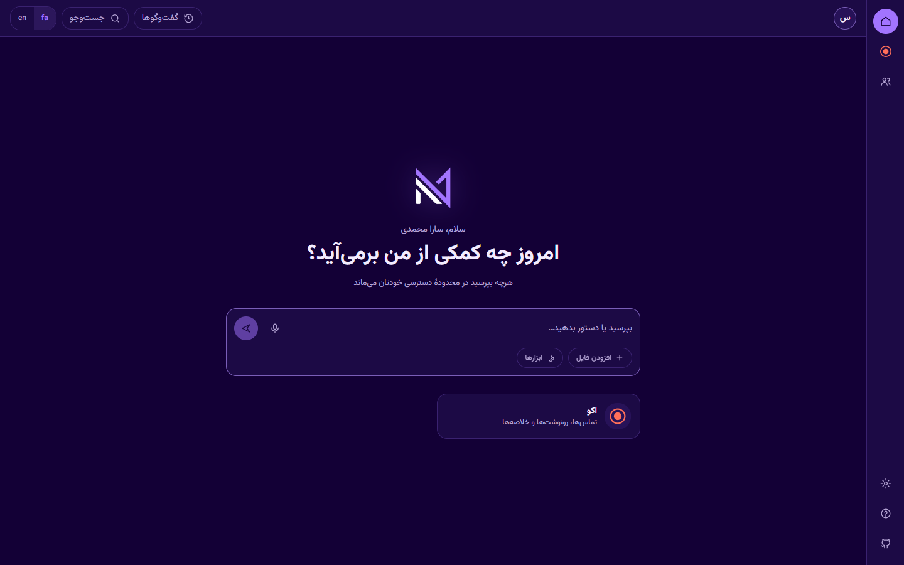
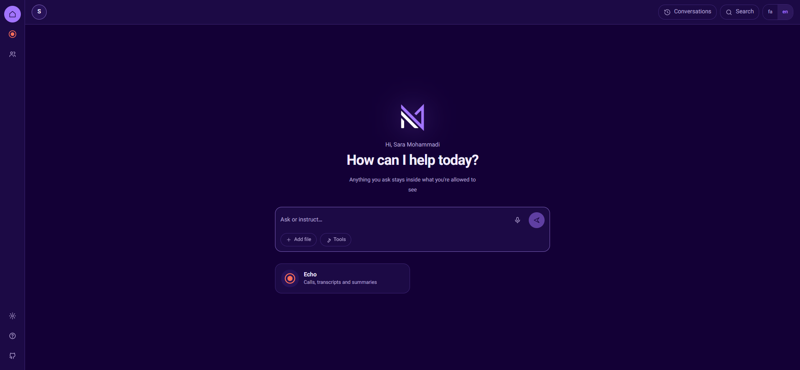
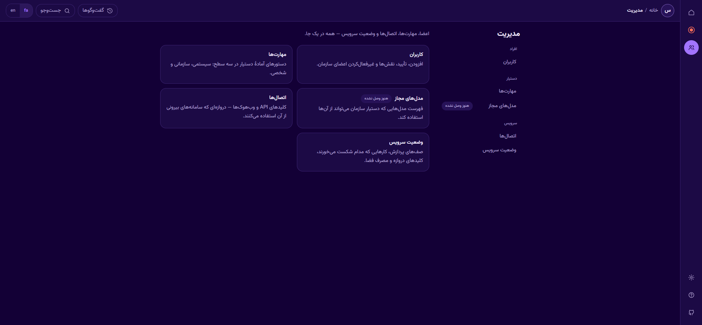
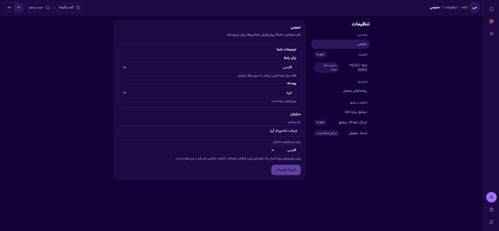
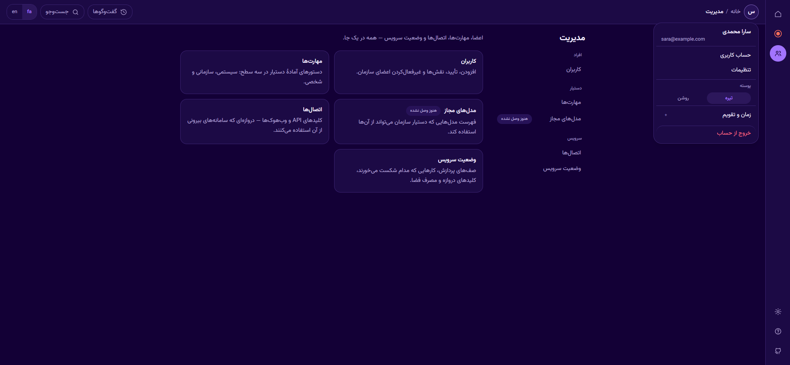
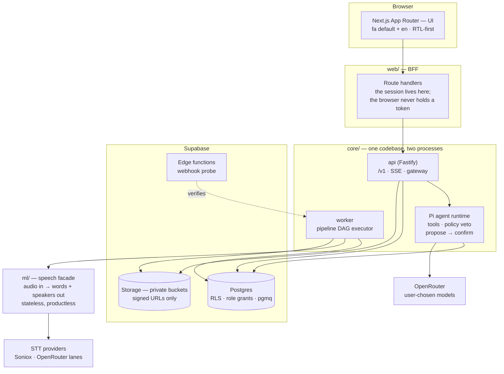
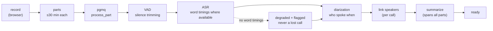

# NeurAI Platform

**An AI assistant platform for organizations — Persian-first, with the Echo
(اکو) call-intelligence app inside it.**

You talk to an assistant that can only see what *you* can see. Echo records
your calls and meetings, transcribes them in Persian, works out who said what,
and turns them into summaries you can question. Everything a user, an agent or
a job touches is bounded by the same permission wall — enforced in the
database, not in a prompt.

> **Status: private, pre-release.** The architecture is locked (v1.0, decisions
> M1–M25 in [ARCHITECTURE.md](ARCHITECTURE.md)); `db/`, `core/` and `ml/` are
> built and tested, `web/` is wiring the last milestone-4 surfaces. Nothing
> here is deployed for real users yet.

---

## What it does

| Surface | What you get |
|---|---|
| **Assistant hub** | The first page *is* the assistant: ask anything, get answers drawn from what you have access to. Conversations persist; history is reachable, never permanent chrome. |
| **Echo — record** | Browser capture that writes in 30-minute parts as it goes, so a crash costs one part, never the call. Part N uploads while N+1 records. |
| **Echo — calls** | Every call becomes a titled, summarized object: speaker-labelled transcript, word-level timing where the engine gives it, tap-to-seek. |
| **Ask your calls** | Grounded Q&A over transcripts with timestamp citations, plus write actions that go through a propose → you confirm → execute loop. |
| **User management** | Invitations, three roles (owner / admin / member), suspend, and a true-delete that actually removes a person, with a tombstone so the record of the deletion survives. |
| **API gateway** | Per-member API keys minted show-once, each acting with exactly its owner's authority — never more — plus webhooks with signed delivery and a delivery log. |
| **Both languages** | Persian default and English, RTL-first, Vazirmatn, Persian digits, Jalali-capable dates — not a translation layer bolted on. |

### Built vs. designed

The information architecture is complete; some panels behind it are not.
Rather than hide the unbuilt ones, the app names them and says so on the page
— a control that looks live and silently does nothing is worse than an honest
blank. Where this README describes the product, it marks the difference too:

"Verified" is three different claims here, and the project keeps them apart —
flattening them is how a repo starts lying about itself:

1. **Fixture-proven** — the logic is asserted against a captured response body.
2. **Screen-verified** — someone loaded it in a browser and measured it: RTL at
   both widths, contrast, the awkward states.
3. **Live-token-verified** — exercised against the real server as a real signed-in
   person. **Nothing is at level 3 yet**, because sign-in doesn't complete end to
   end (see below).

| Surface | State |
|---|---|
| Assistant hub · Echo (record + calls) · call detail · search · Management (Users, Connectors) | **Built** — screen-verified |
| Audit Logs — read surface | **Built** — reads the real trail (admin actions, agent runs, proposal decisions) |
| Management · Server health | **Built** — live per-metric reads, screen-verified |
| Settings — section IA, your own preferences, organisation form | **Built** — screens live; the client swaps to the live path with auth |
| Conversations | **Server live, UI live** — joined end to end with auth |
| Management · Models | **Named, not wired** — visible with an on-page notice |
| Log Drains | **Backend exists; read surface not wired** |
| SSO, Legal Documents | **Out of v1 scope** — listed so the IA is honest, not implemented |

**Sign-in is the one gap that matters.** The accounts, roles and permission wall
are all built and tested, but the browser sign-in flow isn't completable yet, so
no surface has been exercised end to end as a real signed-in user. Until it is,
the two token-gated surfaces (Audit Logs, Server health) can't be photographed
truthfully — an unauthenticated browser shows their error state, which would
libel a working surface. They're absent from the screenshots below for exactly
that reason.

## Screenshots

From the running shell with seeded demo data. The product is Persian-first, so
these are the Persian screens; the English locale is the same UI mirrored.

| Assistant hub — fa | Assistant hub — en |
|---|---|
|  |  |

| Echo — record and calls, one screen | Management · Users |
|---|---|
|  |  |

| Call detail — the timing ladder | Search |
|---|---|
|  |  |

| Management · Connectors | Management — two-pane, grouped |
|---|---|
|  |  |

| Settings · General | Account menu |
|---|---|
|  |  |

Four things worth noticing, because they are deliberate. **Nothing is faked**:
a tile with no honest trend to show prints `—` and explains itself. **The
assistant docks rather than takes over** — selecting an app keeps the app
reachable at every width, with no dialog to dismiss on arrival. **An API key
is a member, not a service account**: it can do exactly what its owner can do,
and disabling the person disables the key in the same instant. And **a
degraded transcript says which part degraded** — a call that is 95% word-timed
warning as though the whole transcript were unreliable was a real bug; the
chip naming *part* of the call is the fix, and the visible proof of the timing
ladder.

> Captured from the current build. Sign-in screens are deliberately absent
> because the flow can't complete end to end yet, and a screenshot would promise
> something that doesn't work — as are the two surfaces that need a real token to
> render their data, for the same reason in reverse: unauthenticated, they show
> an error that isn't the truth about them.

## Architecture

Four packages, three planes. The control plane owns identity and permissions,
the work plane moves jobs, the data plane holds the record and the indexes
that can be rebuilt from it. Full reasoning, decision by decision, in
[ARCHITECTURE.md](ARCHITECTURE.md).



**The wall is the database.** Every row carries `org_id`; RLS policies enforce
org isolation and private/org scope; role grants stop writes no code path
should perform (the agent's role has no `DELETE`). A pipeline job runs *as the
call's owner* — identity travels in the job payload, and the worker fails
closed if the call isn't visible to that identity. There is no service-account
back door.

### The pipeline



Every step is idempotent — it checks for its artifact, not a done flag — so a
retry is safe. Failures retry with backoff, then land in a dead-letter queue;
a failed call is *visibly* failed and resumable. When a transcription lane
can't carry word timestamps, the call degrades to line-level timing and says
so, rather than being lost (the timing ladder, M20).

## Stack

| Layer | Choice |
|---|---|
| Language | TypeScript everywhere (M9) |
| `web/` | Next.js App Router · next-intl · Tailwind · RTL-first · Vazirmatn |
| `core/` | Fastify · zod at every boundary · pino (no content in logs) · SSE |
| Agent | Pi (`pi-agent-core` + `pi-ai`) — the scope wall is ours, not the harness's |
| `ml/` | Soniox + OpenRouter STT lanes · Silero VAD · sherpa-onnx diarization |
| Data | Supabase Postgres · hand-written SQL migrations · RLS + role grants · Drizzle for queries only · pgmq |
| Tests | Vitest per package · a SQL suite that tests the wall itself · live acceptance runs |

## Repository layout

| Path | Contents |
|---|---|
| [`ARCHITECTURE.md`](ARCHITECTURE.md) | The source of truth — locked M-decisions with rationale |
| [`docs/SPEC.md`](docs/SPEC.md) | Product behaviour |
| [`docs/PLATFORM-ROOT.md`](docs/PLATFORM-ROOT.md) | Privacy-preserving platform-root bootstrap and operations |
| [`db/`](db/) | Numbered SQL migrations, RLS/grant policies, and the suite that proves them |
| [`core/`](core/) | API, agent runtime, worker, gateway |
| [`ml/`](ml/) | The speech facade — audio in, words + speakers out |
| [`web/`](web/) | UI + BFF |
| [`brand/`](brand/), [`design-system/`](design-system/) | Marks, tokens, and the contrast gate |
| [`spike/`](spike/) | Phase-0 validation evidence (throwaway by design) |

---

## Running it

Everything below is reproducible on a clean machine with **your own** Supabase
project. No credential in this repo, ever — see [Secrets](#secrets).

### Quick start

**Set up once:**

1. **Node ≥ 22** and **pnpm**, then `pnpm install` in the repo root.
2. **The NeurAI engine**, which provides the encrypted (Windows DPAPI) secret
   store the launcher reads from.
3. **The [Neurai-Echo](https://github.com/Dr-Bagheri/Neurai-Echo) repo cloned
   beside this one** — `mvp/` and `Neurai-Echo/` as siblings. Its
   `backend/scripts/get_key.py` is what reads the store.
4. **Store your secrets by name** (values never touch this repo):
   `echo_platform_db_app_url`, `echo_platform_db_agent_url`,
   `echo_platform_jwt_secret`, `echo_platform_supabase_url`,
   `echo_platform_supabase_secret_key`, `openrouter_key` — plus
   `soniox_key` if you want real transcription rather than the stub.

**Then, every day:** double-click **`scripts\start-platform.cmd`**.

It fetches the secrets from the store at runtime, starts the core api
(`:8080`), ml (`:7801`), the worker and the web app (`:3100`) — each in its own
window so a crash stays readable — skips anything already running, waits for
the app to answer, and opens your browser at http://localhost:3100.

Re-run it after a crash: it restarts only what actually died.

> The rest of this section is the detailed reference — what the launcher does
> for you, in case you want to run a piece by hand or on another OS.

### Prerequisites

- **Node ≥ 22** (the packages run TypeScript directly via
  `--experimental-strip-types`)
- **pnpm 9.12.3** — `corepack enable && corepack prepare pnpm@9.12.3 --activate`
- **Docker** — only if you want the local Postgres 17 instead of a Supabase project
- **Supabase CLI** — only for deploying edge functions
- **ffmpeg** on `PATH` — `ml/` shells out to it for transcoding

```bash
pnpm install
```

### Secrets

Credentials live in an OS-encrypted secret store (Windows DPAPI here) or your
environment — never in the repo, never in a file that git can see. The
platform's own credentials are namespaced `echo_platform_*` so they can't be
confused with a neighbouring project's:

| Name | Used by |
|---|---|
| `echo_platform_supabase_url` | everything |
| `echo_platform_supabase_secret_key` | `core/` server-side |
| `echo_platform_jwt_secret` | token verification |
| `echo_platform_db_url` | migrations (owner role) |
| `echo_platform_db_app_url` | `core/` api — the app role |
| `echo_platform_db_agent_url` | the agent role (no `DELETE` grant) |
| `echo_platform_db_purge_url` | the purge process |
| `echo_platform_supabase_access_token` | CLI / edge-function deploys |
| `openrouter_key`, `soniox_key` | provider keys (cross-product, canonical names) |

**Names only — the values are yours.** Put them in your store, or export the
equivalent environment variables (`DATABASE_URL`, `DATABASE_URL_AGENT`,
`OPENROUTER_API_KEY`, …) before starting a process. `ml/.env.example`
documents every `ml/` knob with empty slots; copy it to `.env.local`.

### Database

```bash
pnpm db:up          # local Postgres 17 in Docker on :55432 (skip if using Supabase)
pnpm db:migrate     # apply pending numbered migrations
pnpm db:test        # the RLS / role-grant / column-guard suite — the gate
node db/scripts/db.mjs test --fresh   # ...after rebuilding the schema from zero
```

`db:migrate` targets `DATABASE_URL` if set, otherwise the local container.
The suite is safe to run against a shared dev project: it touches only its own
two fixture orgs and clears them on the way out.

Mint the per-role logins once (passwords are generated with a CSPRNG and
stored, never printed):

```bash
node db/scripts/grant-login.mjs
```

### The services

```bash
# API — http://localhost:8080
pnpm --filter @echo/core api

# Worker — drains the pipeline queues
pnpm --filter @echo/core worker

# Speech facade — http://127.0.0.1:7801
pnpm --filter @echo/ml dev

# UI + BFF — http://localhost:3100
npm exec --prefix web -- next dev --port 3100
```

Start order only matters in one direction: the worker and api need the
database migrated; `web/` needs `CORE_API_URL` pointing at the api.

### Edge functions

```bash
supabase functions deploy echo-webhook-probe --no-verify-jwt
```

`--no-verify-jwt` is deliberate for the probe: it is an *independent* webhook
verifier, so it must accept an unauthenticated delivery and check our
signature itself — that is the whole point of it.

### Tests

```bash
pnpm --filter @echo/db test      # SQL: RLS, grants, column guards, queues
pnpm --filter @echo/core test    # api, agent, worker, gateway
pnpm --filter @echo/ml test      # speech facade, incl. WER harness
pnpm --filter @echo/web test     # components + the contrast gate
pnpm --filter @echo/core typecheck
```

The design system has its own gate — `design-system/neurai-platform/verify-pairs.mjs`
fails the build if any token pair drops below its contrast floor. It runs as
part of `@echo/web test`.

---

## License

Proprietary — all rights reserved. This is a private commercial repository.
