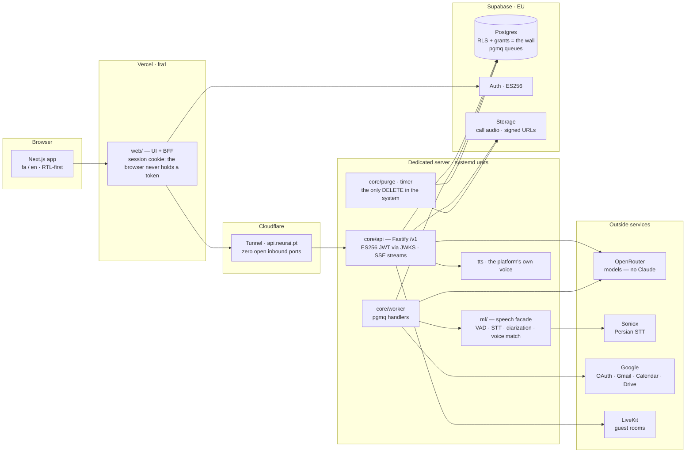
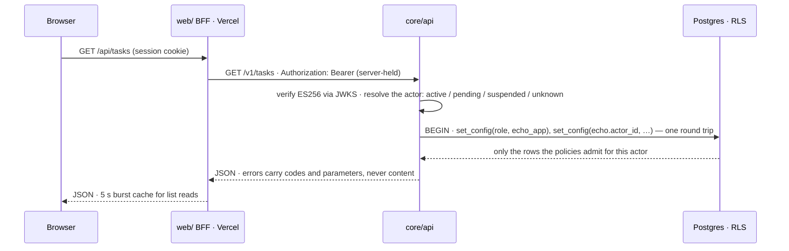
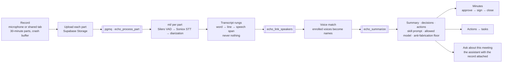
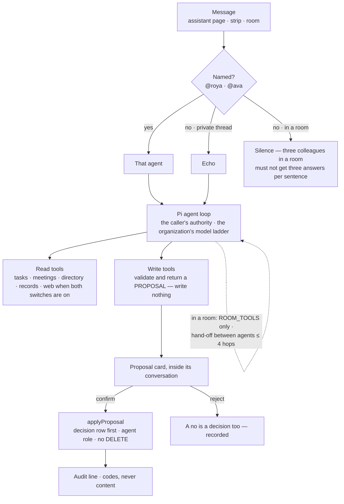
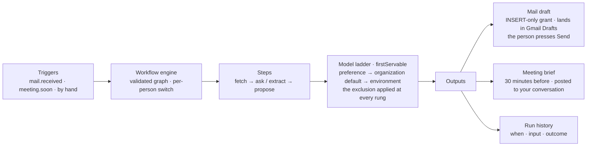
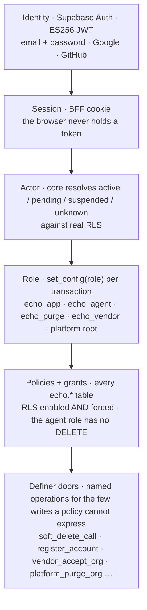

# NeurAI Platform

**A Persian-first AI-assistant platform for organizations. Agents do the
work — people keep the decisions.**

An organization gets a dashboard, meetings that record and transcribe
themselves, a task board, projects, team rooms, workflows that run on real
events, and three AI colleagues — **Echo**, **Roya** and **Ava** — who answer,
draft, prepare and file. Everything an agent proposes to *change* waits for a
human to confirm. Everything an agent *reads* is bounded by the same wall the
humans get: **row-level security in the database, never a prompt.** The
agents' database role cannot delete anything, ever.

> **Status (2026-09-05): deployed and in use.** The app runs at
> **app.neurai.pt** (Vercel, Frankfurt region), the API at **api.neurai.pt**
> (a Cloudflare Tunnel into a dedicated server — no open inbound ports), and
> Postgres, Auth and Storage on Supabase in the EU. The marketing site at
> **neurai.pt** / **neur-ai.ir** is `site/` in this repository. The platform
> has its first real organization; onboarding is deliberate and vendor-gated
> through the platform console.

> **License: source-available.** The code is public to be **read and
> evaluated**, not to be used or copied. See [LICENSE](LICENSE).

---

## Contents

1. [What is inside](#what-is-inside)
2. [How it is built](#how-it-is-built) — topology, a request, the meeting
   pipeline, the agent loop, workflows, the permission stack
3. [Repository layout](#repository-layout)
4. [Running it](#running-it)
5. [Deploying it](#deploying-it)
6. [The quality method](#the-quality-method) — rules that run
7. [The design system](#the-design-system)
8. [Measurements](#measurements)
9. [Naming](#naming) · [License](#license)

---

## What is inside

The product is one shell — a compact icon menu at the start edge, a top bar
with the trail, clock, search, theme, language, notifications, the door to
chat and the account menu, and the assistant strip on every page (its icon or
`Ctrl+E`) — and these surfaces inside it. Every list wears the same toolbar:
one row of views and filters with the *new* button at its end, and a second
row of folders where there is one. Anything opened from a list opens as a
panel over that list with an address of its own.

| Surface | What it does |
|---|---|
| **Dashboard** | Opens with a greeting for the time of day and four counters — upcoming meetings, meetings this month, task completion rate, tasks recorded — then the week as an **hour grid**, the next two meetings and the last two held. Nothing here is stored: every number is counted off your own meetings and tasks on each visit, so the dashboard cannot disagree with the page beside it. A counter with no data yet shows `—`, never zero. |
| **Assistant** | Ask by text or by **voice** (a push-to-talk key that listens while held). Name an agent — `@roya`, `@ava` — and that one answers; unnamed, Echo does. The assistant **acts**: it creates tasks, records meetings, searches the records and opens pages, and every change is shown as a proposal that is not written until you confirm. The strip on every page is the same conversation; history is kept; the model is picked from the organization's allow-list. |
| **Meetings** | A meeting is created with a title, a time, a folder and a way of being held — online, in person, or an uploaded recording — and lives in three stages: *before* (invite people; mint a **guest link** an outsider opens with no account), *during* (the recorder on the microphone or the shared tab, a whiteboard, quick notes, tasks from the room), *after* (the transcript with its speakers, the summary, the decisions and the actions, each action one press from a task). Minutes are **approved → signed → closed**; closed minutes are the record. Meetings are archived, never deleted. |
| **Tasks** | A board with four default columns (add, rename, colour, reorder by dragging the header), kanban / list / calendar / archive views, a priority filter, *just my tasks* and *due today*, and a second row of folders — your own and the ones that are projects. Cards **move by hand** (a mouse drags, a finger holds first). The detail panel carries description, checklist, comments, history, assignees, labels, deadline and **repeat** — the next copy is created when this one is done. Archive keeps; delete asks. |
| **Projects** | An **order of work**: an admin creates it, picks its people and assigns tasks to them; everyone can see it. A project is a folder on the board — its progress is counted off that folder, and it sits in the column where its earliest unfinished work sits. Its panel shows the folder, progress, colour, people, work and *who did what*. Deleting a project keeps the folder, the cards and the project's room. |
| **Chat** | Rooms in the toolbar (unread in bold, a count when you were named), a two-line composer with `@`, microphone and emoji, reply and reactions on right-click. Agents are **guests**: they answer only when named, with room-safe tools only (what every member may already see), and may hand off to each other at most four hops. Invitations land in the bell; rooms are readable by the whole organization. |
| **Workflows** | Work that runs itself, shown as cards with a trigger, ordered steps, the connections it needs and its runs; an on/off switch that is yours alone. Shipped: **draft email replies** (the reply waits in the conversation *and in your own Gmail Drafts* until you press Send — the platform never sends mail) and **meeting prep** (a brief from the related records, half an hour before). A run uses a model the organization permits or stops with a visible message. |
| **Integrations** | Per-person **Google** (Gmail, Calendar, Drive, Meet) over OAuth; email drafting needs its own scope and asks for it separately; the connected tab shows what each connection can do and when it last worked; disconnecting revokes at the provider. Nothing is read without your asking. |
| **Agents** | Echo, Roya and Ava, plus agents the organization authors (name, instructions, icon, colour, web access). Each page states model, web access and kind, then every tool the agent may use, reading first and changing last. An agent works with **your** authority and never more; web access needs the agent's switch *and* yours. |
| **Management** | The organization: general profile, users (owner / admin / member), invitations (one-time links), **member privileges** (members and admins on two tabs; every switch narrows, none grants), and **speakers** — the voice directory, where an enrolled voice becomes automatic speaker identification in meetings. |
| **Settings & account** | Theme and display preferences (the same on every device), the assistant (reply language and length, voices, your own instructions, the push-to-talk key, the wake word, spoken answers, agents' web), notifications (post-call brief, weekly digest, email drafts, meeting prep — each personal), security (signed-in sessions; admins see everyone's and can end any), the organization's **allowed models**, and the audit log. The account page holds photo, names in both languages, username, job title and what you share with the assistant. |
| **Platform console** | `/platform` — the vendor's control plane and the one place outside the organization wall: new arrivals are placed into their organization with role and activation in **one statement**; organization status lives here and nowhere else. |
| **Guest room** | `/join/<code>` — a meeting for somebody outside the organization: one screen, a name to be called by, the room. Deliberately outside the shell; the code in the address is the whole authorization. |
| **Help** | Twelve sections in the menu's own order, each a sketch drawn from the theme and the steps that are true tonight. |
| **Both languages** | Persian default and English. RTL-first, digits follow the language (typed digits too), months follow the calendar preference (Jalali / Gregorian). Not a translation layer bolted on. |

---

## How it is built

Four packages, one repository: `db/` (the schema and its wall), `core/` (API,
worker, agent loop, workflow engine, purge), `ml/` (the speech facade) and
`web/` (the UI and its BFF). Hand-written SQL, no ORM. TypeScript everywhere.
The architecture is a numbered set of decisions, **M1–M47**, in
[ARCHITECTURE.md](ARCHITECTURE.md); the product behaviour of the meeting
engine is in [docs/SPEC.md](docs/SPEC.md); every front-end shape is a numbered
rule in [the rulebook](design-system/neurai-platform/RULEBOOK.md).

### Topology



- **The BFF is the only thing the browser talks to.** Sign-in, sign-up and
  recovery go through `web/src/app/api/auth/*`; the session is a server-side
  cookie and no Supabase token, upstream URL or key ever reaches the client
  bundle. The BFF forwards to `core` with a server-held bearer token and keeps
  a 5-second burst cache for list reads, so a page that fans out into six
  requests pays for the network once.
- **The server runs five units** — `neurai-api`, `neurai-worker`,
  `neurai-ml`, `neurai-tts` and `neurai-purge` (a timer) — behind the tunnel.
  The purge is a third process on its own role because the one `DELETE` in
  the system should live where nothing else does.
- **Every model call goes through OpenRouter** under the organization's
  allow-list, chosen by one ladder (`preference → organization default →
  environment`) that applies the platform's model exclusion at every rung —
  including the ones nobody watches.

### One request



The identity resolution runs against **real RLS**, not a lookup: a pending
member, a suspended organization and an unknown token are four different
answers, and each is a different screen. Postgres errors are logged by
structured field (code, constraint, table, column) — never `message` or
`detail`, which quote the offending row.

### The meeting pipeline



- A long meeting rolls into 30-minute **parts**; one call, one timeline. Each
  part walks the rungs on its own, so one bad part is a visible gap, not a
  lost meeting.
- **Timing degrades but never disappears** (M20): word timings, else line
  timings, else one anchored speech span per part.
- Persian word error rate on the acceptance clip: **2.1 %** (measured
  2026-08-13, post-normalization, on a corrected reference).
- The transcript is the source of truth; every derived artifact is
  rebuildable and carries its provenance. Deletion is soft, retention is a
  window, and the purge deletes **objects first, rows last** — the row is the
  map to the object.

### The agent loop



- **There is no pending-proposals inbox, ever**: outside its conversation a
  proposal loses the sentence that made it approvable.
- The second confirm is a `409` by construction — the decision row's primary
  key is the proposal id.
- In a room the answer is addressed to everybody, so the tool set is exactly
  the tables every active member can already read; per-record scope (calls,
  transcripts, summaries, search) and every admin surface stay out.

### Workflows



"The assistant will not send mail on its own" is a fact about the grant
table: the agent role may `INSERT` a draft and may never `UPDATE` one, and the
recipient, subject and thread come from the message headers — the model never
chooses them.

### The permission stack



- **Row-level security is the wall; prompts are never the wall.** Every
  `echo.*` table has RLS enabled *and forced*; the db test suite asserts
  `rolbypassrls = false` before it trusts any policy check, because a
  superuser passes every policy unconditionally.
- **Role memberships: none, deliberately.** A `42501` at `set role` means a
  miswired connection URL; the standing instruction is to fix the URL and
  never the grant.
- A decision that removes the actor's power to reverse it ships **with its
  exit** (an organization cannot brick itself; an org's status is
  vendor-only, both directions through one door).
- Secrets are **names, never values**: the repository holds environment
  variable names; values live in an OS-encrypted store on the dev machine
  and in root-only env files on the server. No `.env` is tracked, and the
  test suite sweeps every tracked file for encoding corruption at the byte
  level.

---

## Repository layout

```
db/       Hand-written SQL migrations (numbered) · RLS policies · role grants
          · the schema's own test suite (each migration ships with the SQL
          that proves its wall, both ways)
core/     One codebase, three processes:
            src/api      Fastify /v1 — routes per surface, JWT via JWKS, SSE
            src/worker   pgmq handlers: parts, speakers, summaries, workflows,
                         mail polling, meeting prep, signals
            src/agent    the Pi-based loop, tools (read / write / client /
                         platform), proposals, router, delegation, skills
            src/purge    the only DELETE — a third process on its own role
            src/db       withActor: the single door to the database
ml/       The speech facade: audio in → words + speakers out. Productless —
          no database, no identity. VAD, STT, diarization, embeddings, WER
          harness. CONTRACT.md is the interface core/ codes against.
web/      Next.js App Router · UI + BFF · fa/en · RTL-first · design system
          (scaffold tokens, shadcn/Radix primitives copied into the tree)
          · 170+ BFF routes · the guards (see below)
site/     The marketing site (neurai.pt · neur-ai.ir) — a scroll film;
          fa.html is GENERATED from index.html by scripts/build-company-locales.ts
design-system/  RULEBOOK.md (R1–R21), the token verifier (verify-pairs.mjs),
          the original proposals and mocks
docs/     SPEC.md · PLATFORM-OPERATIONS-RUNBOOK.md · WORKFLOWS-AND-AGENTS.md
          · CONNECTORS.md · PLATFORM-ROOT.md · the architecture blueprints
scripts/  provision-server.sh · systemd units · deploy-secrets-to-server.ps1
          · start-platform (local dev stack) · the site's locale build + checker
```

---

## Running it

Requirements: Node ≥ 22, pnpm 9, a Postgres reachable under two role URLs
(`echo_app`, `echo_agent`), and a Supabase project for Auth and Storage.

```bash
# database — apply migrations, then run the schema's own tests
cd db && node scripts/db.mjs migrate && node scripts/db.mjs test

# core api + worker
cd core && npm run api          # boots and answers /health
cd core && npm run worker

# speech service
cd ml && npm run build && npm start

# web (UI + BFF) — http://localhost:3100
cd web && pnpm install && pnpm dev

# the whole local stack on Windows
scripts/start-platform.cmd
```

Environment names (values are never in the repository):

| Package | Names |
|---|---|
| `core` | `DATABASE_URL_APP`, `DATABASE_URL_AGENT`, `SUPABASE_URL`, `SUPABASE_JWKS_URL`, `SUPABASE_JWT_ISSUER`, `SUPABASE_SERVICE_KEY`, `ML_BASE_URL`, `OPENROUTER_API_KEY`, `SONIOX_API_KEY`, `WORKER_SUMMARY_MODEL`, `LIVEKIT_URL` / `LIVEKIT_API_KEY` / `LIVEKIT_API_SECRET`, `EGRESS_S3_*`, `TTS_URL*`, `LOG_LEVEL`, `PORT`, `HOST` |
| `web` | `CORE_API_URL` (server), `CORE_PUBLIC_URL` (the browser's direct SSE address), `NEXT_PUBLIC_SUPABASE_URL`, `NEXT_PUBLIC_SUPABASE_PUBLISHABLE_KEY` |
| `ml` | `ML_LOG_LEVEL` — everything else is a model file under `ml/models/` |

On the dev machine the credentials live in the OS-encrypted store under
`echo_platform_*` names; the provider keys (`openrouter_key`, `soniox_key`)
keep their canonical cross-product names. The reasoning for every one of
those choices is in [CLAUDE.md](CLAUDE.md), which is also the repository's
casebook.

Every package's `npm test` prints the real count. `web`'s suite ends with the
token verifier, a **byte-level encoding sweep** over every tracked file, and a
**production build gate** that builds into its own directory so it can never
collide with a running dev server.

---

## Deploying it

The procedure, the infrastructure map, access recovery and the recorded
gotchas live in [docs/PLATFORM-OPERATIONS-RUNBOOK.md](docs/PLATFORM-OPERATIONS-RUNBOOK.md).
In one paragraph:

- **web** deploys itself: Vercel builds `web/` from `main` on every push
  (`web/vercel.json` pins the Frankfurt region so the BFF sits one hop from
  the API). The marketing site is a second Vercel project rooted at `site/`.
- **core / ml** deploy as a git archive onto the server plus the model files,
  then the systemd units restart. The discriminating check for a new route is
  `401` (wired) against `404` (absent).
- **db** migrations run against production with the same runner and the same
  tests as locally; the purge-coverage check derives its list from the
  catalogue, so a new organization-scoped table that the purge has not
  learned fails the migration rather than the purge.
- A deploy check on Vercel must be **cache-busted** (a query string, not
  `Cache-Control`), or it measures the CDN rather than the deployment.

---

## The quality method

The repository's engineering rules are **things that run**, each distilled
from a real incident recorded in the casebook. A rule in prose protects only
whoever is currently remembering it.

- **Verify-red.** A test is trusted only after it has been watched failing
  *for its own reason*. A red that names a different defect is not a
  verify-red; a verify-red that stays green is itself the finding.
- **Boot tests** spawn the real runtime under the production flags and demand
  one answered request — a green suite is not evidence the process starts
  (`core/test/api-boot.test.ts`, `worker-boot`, `purge-boot`).
- **Seam instruments** (a producer with no consumer is a defect its owner
  cannot see): every function granted to a role has a caller; every internal
  href resolves in the route tree; every organization-scoped table is either
  purged or excepted with a reason (`db/test/102_purge_coverage.sql`); every
  queue has exactly one handler (`core/test/queue-handlers.test.ts`); every
  nav destination has an icon; every wire vocabulary is covered by the
  guard that derives its list from the producer.
- **Fixtures come from producers and reality**, never from the code's own
  beliefs; counts are never asserted where a property will do; a fixture's
  ground truth comes from the audio, never its filename.
- **Positive detection** for every model integration — a model wired wrong
  fails silently, so something must be positively found on real data, and a
  missing system floor (a shipped prompt, a seeded skill) fails loudly.
- **Distinguish the kinds of nothing.** Absent-because-invisible is not
  absent-because-missing; a component that finds nothing names *which*
  nothing, and a checker that can pass vacuously asserts it had something to
  check.
- **Verify the rendered artifact**, not the source that should have produced
  it: layout with hit-testing, stylesheets with computed values, themes on a
  full load in the state the user arrives in.
- **Front-end guards** in `web/src/**/*.guard.test.ts` — the rulebook as
  tests: `rhythm` (page spacing lives in the theme), `surface` (three card
  surfaces and nothing else, counted per file), `control` (three control
  sizes; no geometry beside `btn`), `copy` (no explanation under a title, the
  four kinds that may stay listed with reasons), `board` (the two kanbans are
  one board), `detailPanel` (one detail frame), `dialogSections` (dividers
  between a dialog's sections), `nativeDialog` (no `window.prompt`),
  `seededCopy` (no seeded English on a Persian screen), `bridge` (every
  library class resolves in the theme), `direction` (Radix reads RTL from a
  provider), `loading` (structure before data), `keys` (every referenced key
  exists in both catalogues), and the rest.

---

## The design system

Persian-first and dark-first. One font (Vazirmatn) in both locales, digits
following the language, months following the calendar preference. Tokens are
computed and verified — `design-system/neurai-platform/verify-pairs.mjs`
fails the suite on a contrast pair below its floor — and every front-end
shape is a numbered rule with a status (`PROPOSED → APPROVED → FIXED →
SOLID`) in [RULEBOOK.md](design-system/neurai-platform/RULEBOOK.md):
the page rhythm (R1), one toolbar shape with the create button at the end
of row one (R3), three control sizes (R4), three surfaces (R7), one dialog
corner (R8), tables that page at ten rows (R9), one detail frame (R18), no
explanation under a title (R21). The reference measurements the rules were
taken from are recorded with their conditions at the head of
`web/src/components/scaffold/constants.ts`.

---

## Measurements

Counted on **2026-09-05** with the commands shown. The instrument is the
truth; this table is a dated reading of it.

| What | Reading | Command |
|---|---|---|
| Database migrations | 191 | `ls db/migrations \| wc -l` |
| Database test files | 56 | `ls db/test \| wc -l` |
| `core` tests | 1,358 | `cd core && npm test` |
| `core` `/v1` routes | 235 | grep of `app.<verb>(` in `core/src/api` |
| `web` tests | 1,099 (+ gate + encoding sweep + token verifier) | `cd web && npm test` |
| `web` BFF routes | 172 | `find web/src/app/api -name route.ts` |
| `web` pages | 45 | `find "web/src/app/[locale]" -name page.tsx` |
| Persian WER on the acceptance clip | 2.1 % (2026-08-13) | `ml/test/wer/` |
| Warm query, server → Postgres | 6–7 ms (2026-09-05) | measured from the server |

---

## Naming

**NeurAI Platform** is the platform and its shared shell. **Echo** is the
general assistant and the name of the meeting engine's first app; **Roya**
and **Ava** are the two other system agents. **Echo Mobile** is the Android
recorder (its own repository).

## License

Source-available, all rights reserved — read and evaluate freely; using,
copying, redistributing, or training on this code requires written
permission. See [LICENSE](LICENSE) and
[THIRD-PARTY-NOTICES.md](THIRD-PARTY-NOTICES.md).
