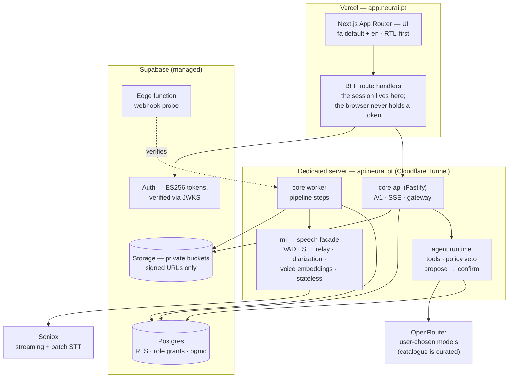
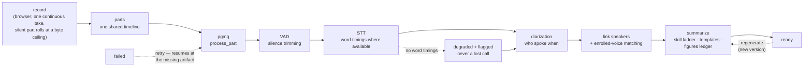

# NeurAI Platform

**An AI assistant platform for organizations — Persian-first, with the Echo
(اکو) call-intelligence app inside it.**

You talk to an assistant that can only see what *you* can see. Echo records
your calls and meetings, transcribes them in Persian, works out who said what,
and turns them into summaries you can question. Everything a user, an agent or
a job touches is bounded by the same permission wall — enforced in the
database, not in a prompt.

> **Status: private, deployed.** Production runs today: the web app on Vercel
> at **app.neurai.pt**, the core api + worker + speech service on a dedicated
> server behind **api.neurai.pt** (Cloudflare Tunnel), and a managed Postgres
> with row-level security as the authorization wall. The platform has its
> first real organization and owner; wider onboarding is deliberate and
> vendor-gated.

---

## What it does

| Surface | What you get |
|---|---|
| **Assistant hub** | The first page *is* the assistant: ask by text or **voice** (it wakes only to its name, stays deaf and silent while you record, stops on «بس/stop», and follows Persian and English in the same breath). Conversations persist; the orb docks in the top bar on every other screen. |
| **Echo — new meeting** | A recording engine that survives navigation (the take docks into the top bar as a mini recorder), with a crash buffer, an LED level meter, live captions, a waveform with chapters, an **agenda checklist** and a **meeting notebook** (first line becomes the chapter), quality guards (quiet / clipping / share-ended / **mic disconnected → auto-pause + fallback**), tab/system audio for online meetings, an optional spoken consent announcement that lands in the record, a one-tap **quick voice memo**, and a red **Stop & delete** that confirms before discarding. Long takes roll silently into parts at a storage ceiling — one call, one timeline. |
| **Echo — records** | Live-refreshing statuses, inline rename, private/org scope switch, archive, **retry** for failed calls, **bulk actions** over selected rows, and deletes that confirm again with a typed reason recorded in the **deletion ledger**. Authority over rows follows the strict role hierarchy (owner > admin > member; peers walled both ways). |
| **A call's page** | Speaker-labelled transcript with honest per-row timing, **click-any-word playback**, reading modes (per-speaker filter, clean-read that hides filler sounds), **versioned summaries** regenerable with meeting **templates** (board / group / team / IT team / interview), a custom instruction, and an optional **figures-and-dates ledger**; English translation on demand; **exports** (SRT / VTT / Markdown) with an ID-**redaction** toggle. |
| **Speakers & voices** | A people directory with org titles, and **scripted voice enrollment** — read a phoneme-rich passage (Persian or English, both always offered) and the pipeline recognizes you automatically in future meetings. Only the voice vector is stored. |
| **User management** | Join-only sign-up (anyone may authenticate; orgs and owners are born only in the vendor console), invitations, three roles + platform root, suspend, and a true-delete with a tombstone so the record of the deletion survives. Sign-in providers (Google / GitHub) have product-level on/off switches. |
| **API gateway** | Per-member API keys minted show-once, each acting with exactly its owner's authority — never more — plus webhooks with signed delivery, replay protection, an address guard, and a delivery log. |
| **Platform console** | Vendor-only: create organizations, mint owners, approve and suspend, and **instant purge** (objects-first) for users and whole organizations — every action with a typed reason in the platform audit. |
| **Both languages** | Persian default and English, RTL-first, Vazirmatn, Persian digits with the language, months with the calendar preference (Jalali/Gregorian) — not a translation layer bolted on. |

## Screenshots

**Being re-shot.** The interface moved to its neutral-black theme with solid
pill buttons in August 2026, and every stored screenshot predates that — a
stale picture would document a product that no longer exists, so the old
gallery is retired rather than left to mislead. Fresh captures of the current
surfaces (the hub, the top bar with the docked mini recorder, New meeting,
the records table, a call page, the speakers directory, Settings, Management,
and the platform console) land here with the next signed-in capture pass.

## Architecture

Four packages, three planes, two deployment homes. The control plane owns
identity and permissions, the work plane moves jobs, the data plane holds the
record and the indexes that can be rebuilt from it.



**The wall is the database.** Every row carries `org_id`; RLS policies enforce
org isolation and private/org scope; role grants stop writes no code path
should perform (the agent's role has no `DELETE`). A pipeline job runs *as the
call's owner* — identity travels in the job payload, and the worker fails
closed if the call isn't visible to that identity. There is no service-account
back door.

### The pipeline



Every step is idempotent — it checks for its artifact, not a done flag — so a
retry is safe. Failures retry with backoff, then land in a dead-letter queue;
a failed call is *visibly* failed and offers a retry button that re-enters the
pipeline exactly where the artifacts say it stopped. When a transcription lane
can't carry word timestamps, the call degrades down a timing ladder (word →
line → anchored span) and says so per row, rather than being lost.

## Stack

| Layer | Choice |
|---|---|
| Language | TypeScript everywhere |
| `web/` | Next.js App Router · next-intl · Tailwind · RTL-first · Vazirmatn |
| `core/` | Fastify · zod at every boundary · pino (no content in logs) · SSE · postgres.js |
| Agent | Pi (`pi-agent-core` + `pi-ai`) — the scope wall is ours, not the harness's |
| `ml/` | Soniox STT (streaming + batch) · Silero VAD · sherpa-onnx diarization · speaker embeddings |
| Data | Supabase Postgres · hand-written SQL migrations · RLS + role grants · **no ORM** (postgres.js only) · pgmq |
| Tests | Vitest per package · a SQL suite that tests the wall itself · a production-build gate · a byte-level encoding sweep · contrast verification · opt-in live lanes |

## Repository layout

| Path | Contents |
|---|---|
| [`ARCHITECTURE.md`](ARCHITECTURE.md) | The source of truth — locked M-decisions with rationale |
| [`docs/SPEC.md`](docs/SPEC.md) | Product behaviour |
| [`docs/PLATFORM-ROOT.md`](docs/PLATFORM-ROOT.md) | Privacy-preserving platform-root bootstrap and operations |
| [`db/`](db/) | Numbered SQL migrations, RLS/grant policies, and the suite that proves them |
| [`core/`](core/) | API, agent runtime, worker, gateway |
| [`ml/`](ml/) | The speech facade — audio in, words + speakers out |
| [`web/`](web/) | UI + BFF |
| [`brand/`](brand/), [`design-system/`](design-system/) | Marks, tokens, and the contrast gate |
| [`spike/`](spike/) | Phase-0 validation evidence (throwaway by design) |

---

## Running it

Everything below is reproducible on a clean machine with **your own** Supabase
project. No credential in this repo, ever — see [Secrets](#secrets).

### Quick start

**Set up once:**

1. **Node ≥ 22** and **pnpm**, then `pnpm install` in the repo root.
2. **The NeurAI engine**, which provides the encrypted (Windows DPAPI) secret
   store the launcher reads from.
3. **The [Neurai-Echo](https://github.com/Dr-Bagheri/Neurai-Echo) repo cloned
   beside this one** — `mvp/` and `Neurai-Echo/` as siblings. Its
   `backend/scripts/get_key.py` is what reads the store.
4. **Store your secrets by name** (values never touch this repo):
   `echo_platform_db_app_url`, `echo_platform_db_agent_url`,
   `echo_platform_jwt_secret`, `echo_platform_supabase_url`,
   `echo_platform_supabase_secret_key`, `openrouter_key` — plus
   `soniox_key` if you want real transcription rather than the stub.

**Then, every day:** double-click **`scripts\start-platform.cmd`**.

It fetches the secrets from the store at runtime, starts the core api
(`:8080`), ml (`:7801`), the worker and the web app (`:3100`) — each in its own
window so a crash stays readable — skips anything already running, waits for
the app to answer, and opens your browser at http://localhost:3100.

Re-run it after a crash: it restarts only what actually died.

> The rest of this section is the detailed reference — what the launcher does
> for you, in case you want to run a piece by hand or on another OS.

### Prerequisites

- **Node ≥ 22** (the packages run TypeScript directly via
  `--experimental-strip-types`)
- **pnpm 9.12.3** — `corepack enable && corepack prepare pnpm@9.12.3 --activate`
- **Docker** — only if you want the local Postgres 17 instead of a Supabase project
- **Supabase CLI** — only for deploying edge functions
- **ffmpeg** on `PATH` — `ml/` shells out to it for transcoding

```bash
pnpm install
```

### Secrets

Credentials live in an OS-encrypted secret store (Windows DPAPI here) or your
environment — never in the repo, never in a file that git can see. The
platform's own credentials are namespaced `echo_platform_*` so they can't be
confused with a neighbouring project's:

| Name | Used by |
|---|---|
| `echo_platform_supabase_url` | everything |
| `echo_platform_supabase_secret_key` | `core/` server-side |
| `echo_platform_jwt_secret` | token verification |
| `echo_platform_db_url` | migrations (owner role) |
| `echo_platform_db_app_url` | `core/` api — the app role |
| `echo_platform_db_agent_url` | the agent role (no `DELETE` grant) |
| `echo_platform_db_purge_url` | the purge process |
| `echo_platform_supabase_access_token` | CLI / edge-function deploys |
| `openrouter_key`, `soniox_key` | provider keys (cross-product, canonical names) |

**Names only — the values are yours.** Put them in your store, or export the
equivalent environment variables (`DATABASE_URL`, `DATABASE_URL_AGENT`,
`OPENROUTER_API_KEY`, …) before starting a process. `ml/.env.example`
documents every `ml/` knob with empty slots; copy it to `.env.local`.

### Database

```bash
pnpm db:up          # local Postgres 17 in Docker on :55432 (skip if using Supabase)
pnpm db:migrate     # apply pending numbered migrations
pnpm db:test        # the RLS / role-grant / column-guard suite — the gate
node db/scripts/db.mjs test --fresh   # ...after rebuilding the schema from zero
```

`db:migrate` targets `DATABASE_URL` if set, otherwise the local container.
The suite is safe to run against a shared dev project: it touches only its own
two fixture orgs and clears them on the way out.

Mint the per-role logins once (passwords are generated with a CSPRNG and
stored, never printed):

```bash
node db/scripts/grant-login.mjs
```

### The services

```bash
# API — http://localhost:8080
pnpm --filter @echo/core api

# Worker — drains the pipeline queues
pnpm --filter @echo/core worker

# Speech facade — http://127.0.0.1:7801
pnpm --filter @echo/ml dev

# UI + BFF — http://localhost:3100
npm exec --prefix web -- next dev --port 3100
```

Start order only matters in one direction: the worker and api need the
database migrated; `web/` needs `CORE_API_URL` pointing at the api.

### Edge functions

```bash
supabase functions deploy echo-webhook-probe --no-verify-jwt
```

`--no-verify-jwt` is deliberate for the probe: it is an *independent* webhook
verifier, so it must accept an unauthenticated delivery and check our
signature itself — that is the whole point of it.

### Tests

```bash
pnpm --filter @echo/db test      # SQL: RLS, grants, column guards, queues
pnpm --filter @echo/core test    # api, agent, worker, gateway
pnpm --filter @echo/ml test      # speech facade, incl. WER harness
pnpm --filter @echo/web test     # components + the contrast gate
pnpm --filter @echo/core typecheck
```

The design system has its own gate — `design-system/neurai-platform/verify-pairs.mjs`
fails the build if any token pair drops below its contrast floor. It runs as
part of `@echo/web test`.

### Production deploys

Production has two homes and three motions:

- **Web** — push to `main`; Vercel builds and promotes automatically. Confirm
  with `npx vercel ls mvp --scope <team>` — a push is not a deploy until the
  newest row says **Ready**.
- **Core (api + worker)** — from the repo root:

  ```bash
  git archive HEAD core | gzip > core-deploy.tar.gz
  scp core-deploy.tar.gz root@<server>:/tmp/
  ssh root@<server> "cd /opt/neurai/app && tar xzf /tmp/core-deploy.tar.gz \
    && systemctl restart neurai-api neurai-worker \
    && curl -sf http://127.0.0.1:8080/health"
  ```

  The deploy is done when `/health` answers 200 and both units are `active`.
- **ml** — same archive path plus `ml/src`, `ml/package.json`,
  `ml/tsconfig.json`; build in `/opt/neurai/app/ml` and restart `neurai-ml`.

Server environment lives in `/etc/neurai/core.env` (app/agent database URLs,
Supabase URL + service key, provider keys). The owner and purge credentials
are deliberately **not** on the server — migrations cannot run from there.

### Migrations in production

Operator-run, never automated, never from the server:

```bash
git pull
sed -i 's/\r$//' db/migrations/*.sql
DATABASE_URL="$OWNER" node db/scripts/db.mjs migrate
git checkout -- db/migrations
```

`$OWNER` must be the Supabase **session pooler** connection string (the
`aws-…pooler.supabase.com:5432` host with the `postgres.<project-ref>` user)
plus `?options=-c%20check_function_bodies%3Doff` — the direct `db.<ref>`
host is IPv6-only and unresolvable from most home networks.

---

## License

**Proprietary — all rights reserved.** This is a private commercial
repository; see [LICENSE](LICENSE). Open-source components it builds on are
listed with their licenses in
[THIRD-PARTY-NOTICES.md](THIRD-PARTY-NOTICES.md).
