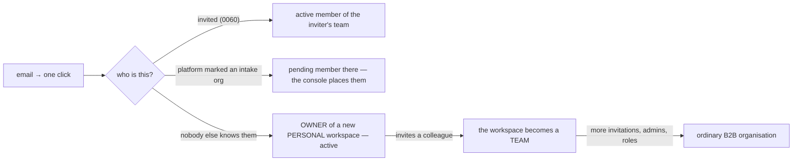

# B2C first — a person arrives into their own workspace, and a team is what a workspace becomes

**Status: PROPOSED 2026-09-15 (user directive: "we mostly built it for B2B
but we need it for B2C as well … start with B2C and then if they want they
can make it a B2B platform"). The parts marked BUILT landed with this
document; the parts marked LATER are seams, named so nobody mistakes their
absence for a decision.**

Companion: `ARCHITECTURE.md` **M54** (the ruling), `docs/ONBOARDING.md` (the
first-time experience, screen by screen).

---

## 1. Where the platform stands today (what "B2B" means in the code)

Every fact below is a line in a migration or a route, not a description.

| Today | Where it lives |
|---|---|
| A person exists only INSIDE an organisation. `app_user.org_id` is NOT NULL and immutable once active. | db/0002, `tg_app_user_guard` (0157) |
| **Signup joins, it never founds.** A bare arrival lands as a PENDING member of the org marked `accepts_signups`, or of the oldest active org when none is marked. | db/0082 → 0149 → 0150 |
| Organisations are born only in the platform console; owners are made only there. | `platform_create_org`, `platform_update_user` (0082) |
| A pending arrival is PLACED (org + role + active, one statement) by the platform root. | `platform_assign_user_org` (0156) |
| An invited person arrives ACTIVE with the granted role — the only instant door. | `redeem_invitation_for_email` (0060) |
| The gate is email + password; the two provider buttons are off "for now"; email confirmation uses a token-hash link to `/api/auth/confirm`. | web `(auth)/sign-in`, `/api/auth/*` |
| A new member's first screen is the assistant page with an empty workspace and no instruction. There is no first-run flow; three guided lessons exist behind the home menu (`lib/tour.ts`). | web |

This is a **managed intake**: nobody gets in until an operator or an admin
decides where they belong. It is right for a company rolling the platform out
to its staff and wrong for a stranger who found the site and wants to try it —
they sign up, see «awaiting approval», and leave.

## 2. Where it goes — person first

> **A person who arrives on their own gets a workspace of their own, immediately.
> A team is not a different product: it is what a workspace becomes the moment
> its owner invites somebody.**

M2 already says this in the schema ("an individual is an org-of-one, no special
case"); what changes is the DOOR, not the model. Nothing is re-architected: the
org row, RLS, roles, the invitation flow, the console — all stay exactly what
they are. The change is who may make an org and when.

The three doors, and the one rule that keeps them safe:

1. **Invited** — unchanged. Address-matched, active on arrival.
2. **Managed intake** — unchanged when an operator chose it: mark ONE org
   `accepts_signups` in the console and every bare arrival pends there. This is
   the switch that turns a deployment back into today's B2B behaviour. **What
   changes is only the default when nothing is marked.**
3. **A workspace of their own** — the founding branch 0082 deleted comes back,
   in one shape only: no org named, no invitation, nothing marked → a new org of
   `kind = 'personal'`, named after the person, and the person is its ACTIVE
   OWNER. The confirmed email is the acceptance (db/0056's own sentence, revived).

The rule: **a name never becomes a membership.** Typing another organisation's
name still joins it PENDING (0082). What a stranger can get by themselves is a
room that contains nothing anyone else could leak into — which is the whole of
why 0056 was safe and why it is safe again.

### 2a. Personal → team

A workspace's `kind` is `personal` or `team`. It flips to `team` **by the act of
inviting** — a trigger on `echo.invitation` insert, so nobody has to remember to
call a second function and no state exists where a personal workspace holds an
invitation (the 0156 argument: one act, one statement). It never flips back:
a team that loses its last colleague is still the thing its owner built.

What `kind` decides:

| | personal | team |
|---|---|---|
| shell copy | «my workspace», «invite your team» is the door | the org's name, Management is the door |
| Management · Users | the owner and an «invite» — nothing else to manage | the roster, roles, pending queue |
| chat rooms / roster surfaces | exist (the agents are colleagues) but are not offered first | as today |
| billing (LATER) | one seat | seats |

None of the walls read `kind`. It is a word for the shell and for copy; RLS,
roles and grants are what they were.

## 3. What must change — by layer

### db — BUILT (db/0223)

- `echo.org.kind text not null default 'team'`, `check (kind in ('personal','team'))`.
  Existing orgs stay `team` (every org on this deployment was born in the console
  or as a demo).
- `register_account` rebuilt on **0150's body** (its true predecessor — the 0155
  lesson): the no-name branch reads `accepts_signups`; marked → pending member
  there; **unmarked → found a personal workspace, active owner**. 0150's "oldest
  active org" fallback is gone: it existed so the door was never shut, and a
  workspace of one's own is the better never-shut.
- `tg_invitation_makes_a_team`: `before insert on echo.invitation` — a personal
  org becomes a team. SECURITY DEFINER because the inviter's RLS on `org` is not
  the point; the act is.
- `echo.app_user.onboarding jsonb not null default '{}'` +
  `onboarding_completed_at timestamptz`. **Backfilled for every existing
  active member** (`coalesce(accepted_at, created_at)`): a first-run flow shown
  to somebody who has used the product for a month reads as a bug.
- `vendor_pending_orgs` / `vendor_accept_org` untouched — they find nothing.
- db/test/119 walks the matrix: personal founding (owner, active, kind,
  onboarding null), managed intake still pends, a name still joins pending, an
  invitation flips the kind, an active member's org is still immutable, the
  check constraint refuses a third kind, the backfill stamped nobody pending.

### core — BUILT

- `/v1/me` serves `org_kind`, `onboarding`, `onboarding_completed_at`
  (capability-gated like every column added since 0073 — an un-migrated
  deployment omits them).
- `PATCH /v1/me/onboarding` — `{ answers?: object, complete?: boolean }`;
  answers MERGE (a step saves its own keys), `complete` stamps the timestamp
  once. In the route manifest.
- `POST /v1/signup` unchanged in shape; `members.register` no longer maps the
  0150 "no organization" refusal (it cannot happen).

### web — BUILT

- **One gate.** `/sign-in` is email-first: `Continue` → the person gets an
  email with a link AND a six-digit code → the link lands on
  `/api/auth/confirm?type=magiclink` (token-hash, server-side exchange, M1) or
  the code is typed into the same screen → `/api/auth/otp/verify`. A person who
  already has a password can still «use a password instead». `/sign-up`
  redirects here: signing up and signing in are the same act now.
- **Register-on-first-sign-in** is unchanged in mechanism and different in
  outcome: the arrival lands `active` in their own workspace and is routed to
  `/onboarding` instead of `/pending`.
- **`/onboarding`** — the first-time experience (docs/ONBOARDING.md). Outside
  the shell like the auth pages; the shell redirects any signed-in member whose
  `onboarding_completed_at` is null there, and the flow writes answers as it
  goes so a reload resumes.
- **First-run door on Home** — «How would you like to use NeurAI first?»: five
  choices, each opening a guided lesson (the existing tour mechanism) and a
  video slot. Shown once; the answer is recorded in `onboarding`.
- The providers stay off (user: "for now"); the PKCE routes and copy are intact.

### operator — YOURS (dashboard settings, nothing in code can do them)

1. **Supabase → Auth → Email Templates → Magic Link.** Replace the body with the
   one in docs/ONBOARDING.md §5: it links to
   `{{ .SiteURL }}/api/auth/confirm?token_hash={{ .TokenHash }}&type=magiclink`
   and prints `{{ .Token }}` as the code. Without this edit the default link
   drops the session into the URL fragment (the M1 arrangement we refuse) and
   the mail carries no code — the gate is correct in code and unreachable in
   configuration, exactly the confirm/recovery situation of 2026-08-15.
2. **Custom SMTP must be on** (it is — Resend, since 2026-08-15). Supabase's
   built-in sender rate-limits at ~2–4 mails/hour, which for a B2C gate is a
   closed door.
3. **Auth → Rate limits**: the OTP rate (default 1 per 60s per address) is fine;
   the sign-in-with-email hourly cap should be raised from the default when the
   site is announced.
4. **Redirect URLs** already list the web origin (confirm/recovery use it).
5. Nothing to flip for B2C mode: **no org marked `accepts_signups` = personal
   workspaces**. To go back to managed intake on a deployment, mark one.

### docs — BUILT

ARCHITECTURE M15 amended, **M54** added; SPEC §Access amended; CLAUDE.md status.

## 4. Decisions

Taken as defaults in this batch (say the word and any of them moves):

| # | Decision | Why this way |
|---|---|---|
| D1 | **Magic link + six-digit code**, one screen. Password stays as a secondary path. | "one click on your email" is the ask; the code is the fallback for a mail client that mangles links, and both ride ONE email. |
| D2 | **Founding is the default; managed intake is the switch** (`accepts_signups`). | One flag the console already has, instead of a new platform setting. |
| D3 | `kind` is **stored**, flipped by the invitation trigger. | The shell and future billing read it; deriving it from a member count would make «team» flicker while an invitation is unredeemed. |
| D4 | Existing members are backfilled as onboarded. | See §3 db. |
| D5 | A personal workspace's name is the person's display name. | The org needs a name; asking a stranger to name a company they do not have is the 0149 mistake. Renaming is the existing org form. |
| D6 | The onboarding asks the same five stages Wispr does, with OUR substance. | User: "the same way". The answers are stored, never used to gate anything. |

Yours to decide (not built, not blocking):

| # | Question |
|---|---|
| Q1 | **Billing**: per-person subscription for a personal workspace, per-seat for a team — M15's "payment processing is a later seam". Which provider, and is there a free tier? (M15 says no trial; a B2C product with no trial and no free tier converts nobody — this is the decision that most changes the funnel.) |
| Q2 | **Self-serve account deletion** for a personal workspace. Today deletion is the platform purge, root-walled. A person who owns their workspace should be able to end it; that is a definer door with a cool-off, and it is not written. |
| Q3 | ~~**Bring the Google button back** on the gate?~~ **ANSWERED 2026-09-16**: the gate draws four doors — Google, Apple, Microsoft, SSO — above «یا» and the email field (docs/ONBOARDING.md §7). Google is on; the three new ones are switches that arrive OFF until the operator configures each provider in the Supabase project (docs/ONBOARDING.md §7). |
| Q4 | **Videos.** The first-run door has a slot per lesson; there are no videos. Screen recordings of the real product (30–60 s each, five of them) are the thing to record once the flow is on production. |
| Q5 | The «Where did you hear about us?» list — I wrote a plausible one; it should be YOUR channels. |

## 4a. Verified before the agents spend (2026-09-16)

User ruling, the day after the door opened: "after they enter they must
need a verification so they can use the full system — the agents on the
system use tokens, so if all can use it, it becomes problematic. For now I
verify them to start using the agents; later we change it. Now I want them to
have an easy entry."

So the structure gains one fact and one door, and the shape of §2 does not
move:

- **`org.verified_at`** (db/0224): null for a workspace founded through the
  gate and not yet looked at; every organisation alive before the migration
  is verified since it was born; every other birth (the console, a demo, an
  invitation into an existing org) takes the column's default and is verified
  from its first second. The founding branch of `register_account` is the ONE
  writer of an unverified row.
- **The wall is a trigger on `echo.agent_run`**: no run opens for an
  unverified organisation, on every model-spending path at once — the
  assistant, the room's agents, the workflows, the summarizer, the pollers.
  core/ carries the fact on the identity (`orgVerified`, absent = no wall),
  pre-checks it where a person is watching (a 403 with the code
  `org_unverified`, rendered as the screen's own sentence), skips the summary
  with a written reason, and skips the polls before a provider is read.
- **What still works unverified: everything else** — recording,
  transcription, the board, the rooms, the meetings, the connections. The
  person sees one sentence where the agents live (Home, the room), and the
  assistant answers a question with the same sentence rather than silence.
- **Who verifies: the platform root**, from the console's organisation row
  («تأیید دسترسی دستیارها» / «لغو تأیید»), audited as `org_verification_set`,
  both directions (D27).
- **"Later we change it"**: the day billing lands (Q1), verification becomes
  the billing state's own fact and this door retires first. Written down so
  nobody mistakes the switch for the design.

The operator's checklist for a new arrival is therefore two lines: watch
the console for an organisation carrying «در انتظار تأیید», and press verify
once a real person is behind it.

## 5. Seams left open, named

- Multi-workspace membership (one account, several teams) — declined for v1
  (M2, re-affirmed 2026-08-20). A person who wants to join a second team uses a
  second address. The personal→team path does not change this.
- A team's owner "leaving" a personal workspace for a company one — a
  migration of rows, not built (0156's own sentence: moving an active member is
  a different operation with a different name).
- Usage / spend per personal workspace — derivable from `agent_run` and the
  call ledger at any time (M15); no surface.
